# پروژه تشخیص تقلب در تراکنش‌های کارت اعتباری
---

## یادداشت درباره استفاده از ابزارهای هوش مصنوعی

در نگارش و بهبود ساختار این فایل README از ابزارهای هوش مصنوعی به‌عنوان کمک استفاده شده است.  
## ۱. شرح مسئله و سناریوی تجاری (Problem Description)

### ۱.۱. سناریوی تجاری (Business Scenario)
امروزه با گسترش پرداخت‌های الکترونیکی و سیستم‌های مالی برخط، روزانه صدها میلیون تراکنش بانکی پردازش می‌شود. در میان این حجم انبوه، درصد بسیار ناچیزی مربوط به تراکنش‌های ساختگی و متقلبانه است. با وجود فراوانی کم، عدم شناسایی به‌موقع این تقلب‌ها سالانه خسارت‌های مالی هنگفت، جرایم نظارتی و سلب اعتماد مشتریان را به همراه دارد. از سوی دیگر، مسدودسازی اشتباه یک تراکنش معتبر (خطای مثبت کاذب یا False Positive) موجب نارضایتی شدید مشتری و اختلال در تجربه کاربری می‌شود. 

بنابراین، پیاده‌سازی سامانه‌ای هوشمند و مبتنی بر یادگیری ماشین که بتواند با دقت و سرعت بالا تراکنش‌های متقلبانه را تفکیک کند، از اولویت‌های حیاتی بانک‌ها و مؤسسات مالی است.

### ۱.۲. اهداف پروژه (Objective)
هدف اصلی این پروژه، طراحی و پیاده‌سازی یک خط‌لوله (Pipeline) کامل و استاندارد در یادگیری ماشین برای شناسایی تراکنش‌های متقلبانه بدون کوچک‌ترین نشت اطلاعاتی (Data Leakage) است. اهداف تفصیلی پروژه عبارتند از:
- **بیشینه‌سازی شناسایی تقلب (Recall بالا):** کشف بیشترین تعداد ممکن از تراکنش‌های متقلبانه جهت کاهش زیان مالی مستقیم.
- **کنترل هشدارهای اشتباه (Precision بالا):** جلوگیری از رد تراکنش‌های مشتریان واقعی و حفظ اعتبار سیستم.
- **معیار ارزیابی اصلی:** استفاده و بهینه‌سازی مدل‌ها بر اساس سطح زیر منحنی دقت-بازیابی (**PR-AUC / Average Precision**) به عنوان استاندارد طلایی در داده‌های به‌شدت نامتوازن (Extreme Class Imbalance).
- **کالیبراسیون آستانه تصمیم‌گیری (Threshold Calibration):** بررسی و تحلیل تأثیر تغییر آستانه تصمیم ($\tau \in \{0.3, 0.5, 0.7\}$) بر توازن میان دقت و بازیابی با توجه به اهداف مدیریت ریسک کسب‌وکار.
- **معماری ماژولار و بازتولیدپذیر:** تفکیک دقیق مراحل پیش‌پردازش، اعتبارسنجی متقاطع لایه‌بندی‌شده (Stratified 5-Fold CV)، مقایسه مدل‌ها و ارزیابی مستقل روی داده‌های آزمون نهایی.

### ۱.۳. معرفی مجموعه داده (Dataset)
در این پژوهش از مجموعه داده استاندارد تراکنش‌های کارت اعتباری مربوط به دارندگان کارت‌های اروپایی در سپتامبر ۲۰۱۳ استفاده شده است:
- **تعداد کل نمونه‌ها:** ۲۸۴,۸۰۷ رکورد تراکنش.
- **عدم توازن شدید کلاسی (Severe Imbalance):**
  - **تراکنش‌های معتبر (کلاس ۰):** ۲۸۴,۳۱۵ رکورد (حدود ۹۹.۸۲۷٪)
  - **تراکنش‌های متقلبانه (کلاس ۱):** ۴۹۲ رکورد (حدود ۰.۱۷۳٪)
- **فضای ویژگی‌ها (۳۰ ویژگی عددی):**
  - ویژگی `Time`: فاصله زمانی (بر حسب ثانیه) میان هر تراکنش و اولین تراکنش ثبت‌شده در مجموعه داده.
  - ویژگی `Amount`: مبلغ تراکنش (دارای چولگی شدید به راست که نیازمند نرمال‌سازی مقاوم است).
  - ویژگی‌های `V1` تا `V28`: تعداد ۲۸ متغیر عددی که به دلیل حفظ حریم خصوصی کاربران و محرمانگی داده‌ها، حاصل تبدیل تحلیل مؤلفه‌های اصلی (PCA) هستند.
- **برچسب هدف (Target):** ستون `Class` که مقادیر باینری می‌پذیرد (مقدار `1` نشان‌دهنده تقلب و مقدار `0` نشان‌دهنده تراکنش عادی است).


## ۲. تحلیل و اکتشاف داده‌ها (Data Analysis & EDA)

فاز آماده‌سازی و تحلیل اکتشافی داده‌ها (EDA) بر روی مجموعه داده خام تراکنش‌های کارت اعتباری با هدف اعتبارسنجی ساختار، بررسی کیفیت داده‌ها و شناخت توزیع ویژگی‌ها انجام شد.

### ۲.۱. آمار کلی مجموعه داده (Dataset Statistics)
* **تعداد کل نمونه‌ها (خام):** ۲۸۴,۸۰۷ رکورد
* **تعداد کل ویژگی‌ها:** ۳۱ ستون (شامل ۳۰ ویژگی ورودی و ۱ متغیر هدف)
* **بررسی رکوردهای تکراری (Deduplication):**
  * تعداد رکوردهای تکراری شناسایی‌شده: **۱,۰۸۱ نمونه** (معادل ۰.۳۸٪ از کل داده‌ها)
  * تعداد نمونه‌های پاک‌سازی‌شده نهایی: **۲۸۳,۷۲۶ رکورد**
  * اثر حذف رکوردهای تکراری در فایل `reports/tables/deduplication_summary.csv` و نمودار `reports/eda/duplicate_removal_impact.png` ذخیره شده است.
* **تقسیم داده‌ها (Stratified 80/20 Train-Test Split):**
  * **مجموعه آموزش (Train):** ۲۲۶,۹۸۰ رکورد (۳۷۸ نمونه تقلب ~ ۰.۱۶۷٪)
  * **مجموعه آزمون (Test):** ۵۶,۷۴۶ رکورد (۹۵ نمونه تقلب ~ ۰.۱۶۷٪)
  * حفظ دقیق نسبت عدم توازن در هر دو بخش با روش نمونه‌برداری طبقه‌ای (Stratified) تضمین شده است.

### ۲.۲. ساختار و اطلاعات ویژگی‌ها (Feature Information)
* **متغیر هدف (`Class`):** باینری ($y \in \{0, 1\}$)
  * کلاس `0` (تراکنش‌های قانونی): ۲۸۴,۳۱۵ نمونه (~ ۹۹.۸۲۷٪)
  * کلاس `1` (تراکنش‌های تقلبی): ۴۹۲ نمونه (~ ۰.۱۷۳٪)
  * نامتوازنی شدید داده‌ها نیازمند توجه ویژه به متریک‌های مبتنی بر Precision-Recall (نظیر PR-AUC) به جای Accuracy است.
* **ویژگی‌های تبدیل‌شده با تحلیل مؤلفه‌های اصلی (`V1` تا `V28`):**
  * به دلیل ملاحظات حریم خصوصی، ۲۸ ویژگی از طریق تبدیل PCA استخراج شده‌اند که همگی پیوسته، عددی و متعامدند.
* **ویژگی‌های اصلی بدون تبدیل:**
  * `Time`: زمان سپری‌شده (به ثانیه) از اولین تراکنش ثبت‌شده در دیتاست.
  * `Amount`: مبلغ تراکنش که دارای چولگی شدید به سمت راست (Right-skewed) بوده و نیازمند مقیاس‌بندی مقاوم (RobustScaler / Log-transform) است.

### ۲.۳. تحلیل مقادیر مفقوده و کیفیت داده (Missing Value Analysis)
* **تعداد مقادیر گم‌شده (Missing Values):** **۰ (صفر)** در تمامی ۳۱ ویژگی.
* تمام ستون‌ها از نوع عددی معتبر (`np.number`) بوده و هیچ‌گونه ناهنجاری ساختاری یا مقادیر خارج از دامنه تعریف‌شده در ورودی خام مشاهده نشد.
* خلاصه آماری توصیفی جامع در مسیر `reports/tables/descriptive_statistics.csv` مستند گردیده است.

---

## ۳. فرضیات اولیه رفتار مدل‌ها (Initial Hypotheses)

با توجه به ماهیت به‌شدت نامتوازن داده‌ها ($0.173\%$ تقلب) و توزیع ویژگی‌ها، رفتار و کارایی مدل‌های کاندید به شرح زیر پیش‌بینی می‌شود:

### ۱. مدل‌های مبتنی بر تقویت گرادیان و آنسامبل درخت‌ها (XGBoost & Random Forest)
* **فرضیه:** این دو مدل بیشترین پتانسیل را برای دستیابی به بالاترین مقدار **PR-AUC** و **F1-Score** دارند.
* **علت:** ساختارهای درختی چندگانه قادرند مرزهای تصمیم‌گیری غیرخطی پیچیده و تعاملات ظریف بین ویژگی‌های PCA را بدون حساسیت شدید به چولگی مقادیر `Amount` یا تفاوت مقیاس‌ها مدل‌سازی کنند. تکنیک تقویت گرادیان در XGBoost به مدل اجازه می‌دهد روی نمونه‌های اقلیت که به‌سختی تفکیک می‌شوند تمرکز نماید.

### ۲. رگرسیون لجستیک (Logistic Regression with `class_weight='balanced'`)
* **فرضیه:** به عنوان یک خط مبنای (Baseline) سریع و پایدار عمل خواهد کرد؛ اما در دستیابی به بالاترین مرزهای تفکیک‌پذیری نسبت به مدل‌های غیرخطی محدودیت خواهد داشت.
* **علت:** به دلیل فرض تفکیک‌پذیری خطی (Linear Separability)، احتمالاً با افزایش حساسیت (Recall) ناشی از وزن‌دهی به کلاس اقلیت، با افت در دقت (Precision) و افزایش هشدارهای کاذب (False Positives) مواجه خواهد شد.

### ۳. الگوریتم نزدیک‌ترین همسایگان (K-Nearest Neighbors - KNN)
* **فرضیه:** عملکرد این مدل به‌شدت وابسته به مقیاس‌بندی دقیق ویژگی‌ها خواهد بود و هزینه محاسباتی زمان استنتاج (Inference Latency) آن روی ۲۲۶ هزار نمونه آموزش بسیار بالا است.
* **علت:** در فضای ابعاد بالا (۳۰ بعدی) و در غیاب چگالی کافی برای کلاس اقلیت، تفکیک همسایگی ممکن است تحت تأثیر نویز نمونه‌های کلاس اکثریت قرار گیرد.

### ۴. درخت تصمیم تک‌عاملی (Decision Tree with `class_weight='balanced'`)
* **فرضیه:** خطر بیش‌برازش (Overfitting) بالایی روی نمونه‌های اندک کلاس تقلب دارد، مگر اینکه پارامترهای عمق (`max_depth`) و حداقل نمونه برگ (`min_samples_leaf`) به‌دقت کنترل شوند.
* **علت:** یک درخت تکی تمایل دارد برای به صفر رساندن خطای آموزش، برگ‌های بسیار ریزی پیرامون رکوردهای تقلب ایجاد کند که قابلیت تعمیم‌پذیری پایینی به مجموعه تست دارند.

### ۵. پرسپترون چندلایه (Multi-Layer Perceptron - MLP / PyTorch)
* **فرضیه:** قابلیت یادگیری نمایش‌های غیرخطی قوی را دارد؛ با این حال نیازمند تنظیم دقیق نرخ یادگیری (`lr`)، نرخ Dropout برای جلوگیری از بیش‌برازش و نرمال‌سازی دقیق ورودی‌ها است تا به دلیل عدم توازن گرادیان‌ها به سمت کلاس اکثریت سوگیری نکند.

## ۴. مقایسه مدل ها و انتخاب بهترین مدل(Model Comparison)
### خانواده مدل‌های Decision Tree

در این مرحله، چندین پیکربندی از مدل **Decision Tree Classifier** با استفاده از Grid Search بررسی شدند. 
ارزیابی مدل‌ها با تمرکز بر **PR-AUC** انجام شد؛ زیرا داده‌های مسئله به‌شدت نامتوازن هستند و تنها حدود `0.17%` از نمونه‌ها متعلق به کلاس تقلب‌اند. در چنین شرایطی، معیارهایی مانند Accuracy می‌توانند گمراه‌کننده باشند، در حالی که PR-AUC توان مدل در تفکیک تراکنش‌های تقلبی را با توجه هم‌زمان به Precision و Recall بهتر نشان می‌دهد.

برای کاهش خوش‌بینی ناشی از ارزیابی روی داده‌های آموزش، نتایج اعتبارسنجی با پیش‌بینی‌های **Out-of-Fold (OOF)** محاسبه شده‌اند. بنابراین، امتیازهای اعتبارسنجی بیانگر عملکرد مدل روی داده‌هایی هستند که در زمان آموزش هر fold دیده نشده‌اند.

#### مقایسه پیکربندی‌های برتر

<p align="center">
  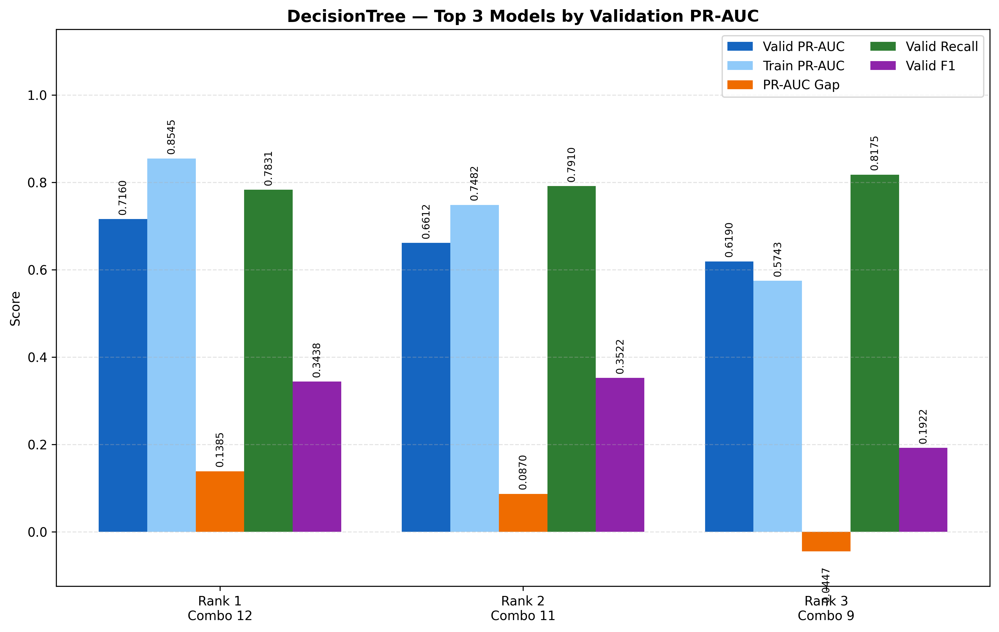
</p>

<p align="center"><em>
شکل: مقایسه سه پیکربندی برتر درخت تصمیم بر اساس PR-AUC اعتبارسنجی، PR-AUC آموزش، شکاف آموزش-اعتبارسنجی، Recall و F1-score.
</em></p>

بهترین پیکربندی این خانواده، **Combo 12**، با مقدار `Validation PR-AUC = 0.7160` به دست آمد. 
این مقدار در مقایسه با نرخ پایه‌ی تقلب در داده‌ها (حدود `0.0017`) بسیار بالاتر است و نشان می‌دهد مدل توان معناداری برای رتبه‌بندی نمونه‌های تقلبی دارد.

با این حال، برای Combo 12 اختلاف نسبتاً قابل‌توجهی بین `Train PR-AUC = 0.8545` و `Validation PR-AUC = 0.7160` دیده می‌شود؛ یعنی شکاف آموزش و اعتبارسنجی برابر با `0.1385` است. این فاصله می‌تواند نشانه‌ای از **بیش‌برازش (Overfitting)** باشد؛ به این معنا که مدل جزئیات داده‌های آموزشی را بهتر از الگوهای قابل‌تعمیم به داده‌های جدید یاد گرفته است.

**Combo 11** با `Validation PR-AUC = 0.6612` رتبه دوم را دارد، اما شکاف کوچک‌تری (`0.0870`) میان عملکرد آموزش و اعتبارسنجی نشان می‌دهد. علاوه بر این، این پیکربندی با `Recall = 0.7910` و `F1-score = 0.3522`، بهترین F1-score را در میان سه مدل برتر دارد. بنابراین، Combo 11 از دید توازن میان Precision و Recall، گزینه‌ای پایدارتر از Combo 12 به نظر می‌رسد؛ هرچند PR-AUC آن پایین‌تر است.

**Combo 9** با وجود Recall بالاتر (`0.8175`) و `Validation PR-AUC = 0.6190`، F1-score پایین‌تری (`0.1922`) دارد. این الگو نشان می‌دهد که افزایش Recall در این پیکربندی احتمالاً با افزایش هشدارهای مثبت کاذب و افت Precision همراه بوده است. از آنجا که بررسی دستی تراکنش‌های مشکوک هزینه‌بر است، این وضعیت برای مدل نهایی مطلوب نیست.

#### رتبه‌بندی همه پیکربندی‌ها و بررسی بیش‌برازش

<p align="center">
  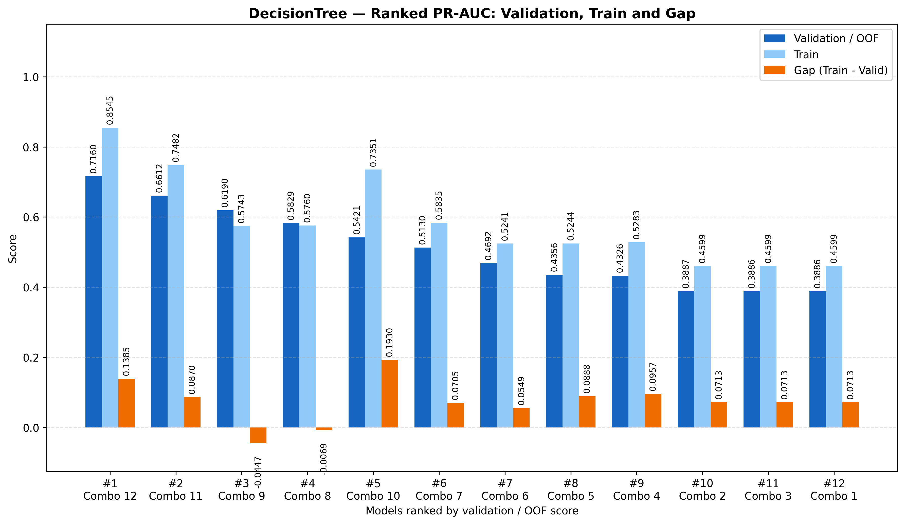
</p>

<p align="center"><em>
شکل: مقایسه PR-AUC آموزش و اعتبارسنجی برای تمام پیکربندی‌های بررسی‌شده. ستون نارنجی اختلاف عملکرد Train و Validation را نشان می‌دهد.
</em></p>

در رتبه‌بندی کلی، تنها چند پیکربندی اول عملکرد قابل‌قبولی دارند و پس از آن PR-AUC اعتبارسنجی به‌تدریج کاهش پیدا می‌کند. همچنین، در برخی پیکربندی‌ها شکاف مثبت قابل‌توجه میان امتیاز آموزش و اعتبارسنجی مشاهده می‌شود؛ برای مثال، Combo 10 با وجود `Train PR-AUC = 0.7351` تنها `Validation PR-AUC = 0.5421` ثبت کرده است. این رفتار نشان می‌دهد که درخت‌های تصمیم، در صورت انتخاب نامناسب پیچیدگی مدل، مستعد بیش‌برازش روی داده‌های آموزشی هستند.

در Combo 9 و Combo 8 اختلاف آموزش و اعتبارسنجی اندکی منفی است. این موضوع لزوماً به معنای بهتر بودن مدل نیست و می‌تواند ناشی از تغییرات نمونه‌گیری میان foldها، پراکندگی داده‌های اقلیت، یا تفاوت در نحوه محاسبه امتیاز آموزش و OOF باشد. با وجود این، معیار اصلی انتخاب همچنان PR-AUC اعتبارسنجی و پایداری کلی مدل است.

#### منحنی‌های Precision–Recall

<p align="center">
  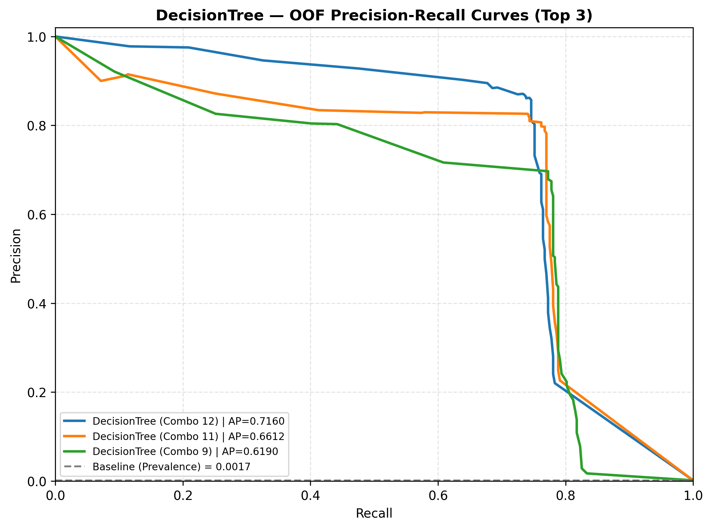
</p>

<p align="center"><em>
شکل: منحنی‌های Precision–Recall مبتنی بر پیش‌بینی‌های Out-of-Fold برای سه پیکربندی برتر. خط‌چین نرخ پایه کلاس مثبت، حدود 0.0017، را نمایش می‌دهد.
</em></p>

منحنی‌های Precision–Recall نشان می‌دهند که هر سه پیکربندی منتخب عملکردی بسیار بهتر از خط پایه دارند. Combo 12 در بخش بزرگی از دامنه Recall، Precision بالاتری ارائه می‌دهد و به همین دلیل بالاترین مقدار Average Precision یا PR-AUC را کسب کرده است.

با افزایش Recall به محدوده‌های نزدیک `0.75` تا `0.80`، Precision هر سه مدل افت محسوسی پیدا می‌کند. این رفتار در مسئله کشف تقلب طبیعی است: برای شناسایی درصد بیشتری از تراکنش‌های تقلبی، مدل باید تراکنش‌های بیشتری را مشکوک علامت‌گذاری کند و در نتیجه تعداد مثبت‌های کاذب افزایش می‌یابد. بنابراین، آستانه تصمیم نهایی باید بر اساس هزینه عملیاتی بررسی هشدارها و حداقل Recall موردنیاز تنظیم شود، نه صرفاً با آستانه پیش‌فرض `0.5`.

#### جمع‌بندی خانواده Decision Tree

- **Combo 12** از نظر قدرت تفکیک کلی، بهترین مدل این خانواده است و با `OOF PR-AUC = 0.7160` رتبه اول را کسب کرده است.
- با وجود عملکرد بالای Combo 12، شکاف `0.1385` بین PR-AUC آموزش و اعتبارسنجی نشان می‌دهد که باید ریسک بیش‌برازش آن در مقایسه نهایی با سایر خانواده‌های مدل در نظر گرفته شود.
- **Combo 11** PR-AUC پایین‌تری دارد، اما به دلیل شکاف کمتر بین آموزش و اعتبارسنجی و بهترین F1-score، یک گزینه متعادل‌تر در این خانواده محسوب می‌شود.
- درخت تصمیم یک baseline غیرخطی و قابل‌تفسیر مناسب است، اما به علت حساسیت به تغییرات داده و احتمال بیش‌برازش، در این مرحله به‌عنوان مدل نهایی انتخاب نمی‌شود. تصمیم نهایی پس از مقایسه با خانواده‌هایی مانند Random Forest، XGBoost و مدل‌های خطی اتخاذ خواهد شد.

### خانواده مدل‌های K-Nearest Neighbors (KNN)

در این مرحله، 16 پیکربندی مختلف از مدل **K-Nearest Neighbors (KNN)** بررسی شدند. 
همانند سایر خانواده‌های مدل، معیار اصلی رتبه‌بندی **PR-AUC** بر مبنای پیش‌بینی‌های **Out-of-Fold (OOF)** است. این انتخاب به دلیل نامتوازن بودن شدید داده‌ها انجام شده است؛ زیرا نرخ نمونه‌های تقلبی تنها حدود `0.17%` یا `0.0017` است و معیارهایی مانند Accuracy نمی‌توانند عملکرد واقعی مدل را به‌خوبی نمایش دهند.

در KNN، پیش‌بینی هر نمونه بر اساس شباهت آن به نزدیک‌ترین نمونه‌های آموزشی انجام می‌شود. بنابراین، کیفیت مقیاس‌بندی ویژگی‌ها، انتخاب تعداد همسایه‌ها، نوع وزن‌دهی همسایه‌ها و معیار فاصله می‌تواند تأثیر زیادی بر عملکرد نهایی داشته باشد.

#### مقایسه سه پیکربندی برتر

<p align="center">
  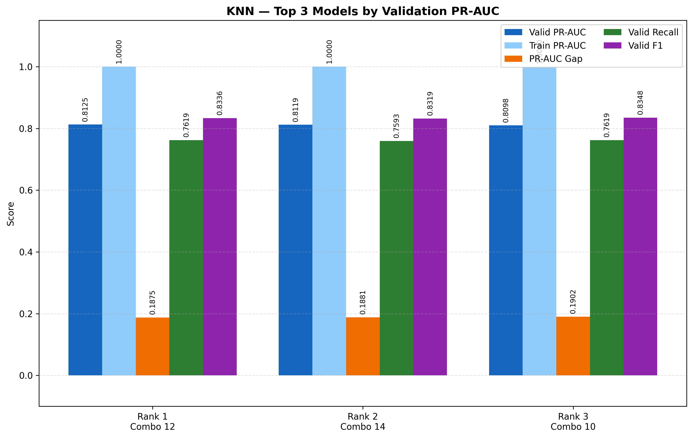
</p>

<p align="center"><em>
شکل: مقایسه PR-AUC آموزش و اعتبارسنجی، شکاف Train–Validation، Recall و F1-score برای سه پیکربندی برتر KNN.
</em></p>

بهترین مدل این خانواده، **Combo 12**، مقدار `OOF PR-AUC = 0.8125` را به دست آورده است. 
این مقدار به‌طور معناداری بالاتر از خط پایه‌ی مسئله (`0.0017`) است و نشان می‌دهد KNN توان بسیار خوبی برای رتبه‌بندی تراکنش‌های تقلبی بالاتر از تراکنش‌های عادی دارد.

سه پیکربندی برتر از نظر PR-AUC بسیار به یکدیگر نزدیک‌اند:

| رتبه | پیکربندی | OOF PR-AUC | Train PR-AUC | شکاف Train–OOF | Recall | F1-score |
|---:|---|---:|---:|---:|---:|---:|
| 1 | Combo 12 | 0.8125 | 1.0000 | 0.1875 | 0.7619 | 0.8336 |
| 2 | Combo 14 | 0.8119 | 1.0000 | 0.1881 | 0.7593 | 0.8319 |
| 3 | Combo 10 | 0.8098 | 1.0000 | 0.1902 | 0.7619 | 0.8348 |

با وجود برتری جزئی Combo 12 در PR-AUC، **Combo 10** بالاترین F1-score (`0.8348`) را در میان سه مدل برتر ثبت کرده است. با این حال، اختلاف F1 میان این سه مدل بسیار کوچک است؛ بنابراین، معیار اصلی رتبه‌بندی این خانواده همچنان OOF PR-AUC در نظر گرفته می‌شود.

نکته مهم این است که هر سه مدل برتر مقدار `Train PR-AUC = 1.0000` دارند، در حالی که عملکرد OOF آن‌ها حدود `0.81` است. شکاف تقریباً `0.19` میان داده‌های آموزش و اعتبارسنجی نشان می‌دهد که KNN روی داده‌های آموزشی عملکردی تقریباً کامل دارد، اما بخشی از این عملکرد به داده‌های دیده‌نشده تعمیم پیدا نمی‌کند. این وضعیت نشانه‌ای از **حساسیت یا بیش‌برازش نسبی** مدل است و باید هنگام انتخاب نهایی در نظر گرفته شود.

#### رتبه‌بندی تمام پیکربندی‌های KNN

<p align="center">
  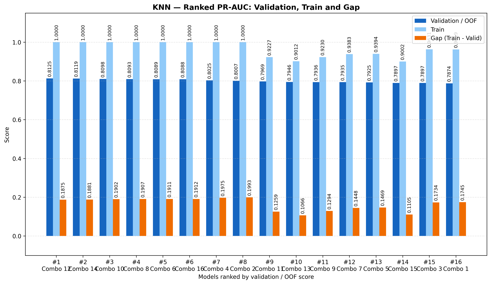
</p>

<p align="center"><em>
شکل: مقایسه PR-AUC آموزش، PR-AUC اعتبارسنجی مبتنی بر OOF و شکاف میان آن‌ها برای تمام پیکربندی‌های KNN.
</em></p>

نتایج نشان می‌دهند که عملکرد KNN در میان پیکربندی‌های مختلف نسبتاً پایدار است. مقدار PR-AUC اعتبارسنجی برای 16 پیکربندی در بازه‌ی تقریبی `0.7874` تا `0.8125` قرار دارد. به عبارت دیگر، حتی مدل‌های پایین‌تر در این خانواده نیز از نظر قدرت رتبه‌بندی نمونه‌های تقلبی عملکرد مناسبی ارائه می‌دهند.

با این حال، تقریباً در همه پیکربندی‌ها امتیاز آموزش به‌طور محسوسی بالاتر از امتیاز اعتبارسنجی است. برای چندین مدل، PR-AUC آموزش به `1.0000` رسیده، در حالی که PR-AUC اعتبارسنجی حدود `0.80` باقی مانده است. این الگو نشان می‌دهد که KNN قادر است ساختار داده‌های آموزشی را با دقت بسیار بالا حفظ کند، اما به دلیل وابستگی به همسایه‌های محلی ممکن است به تغییرات نمونه‌گیری و داده‌های جدید حساس باشد.

در میان مدل‌هایی که به PR-AUC آموزش کامل نرسیده‌اند، برای مثال Combo 13 دارای شکاف کمتری (`0.1066`) است؛ اما PR-AUC اعتبارسنجی آن (`0.7946`) همچنان پایین‌تر از مدل‌های برتر است. بنابراین، شکاف کمتر به‌تنهایی برای انتخاب مدل کافی نیست و باید هم‌زمان با توان تفکیک کلی مدل بررسی شود.

#### منحنی‌های Precision–Recall

<p align="center">
  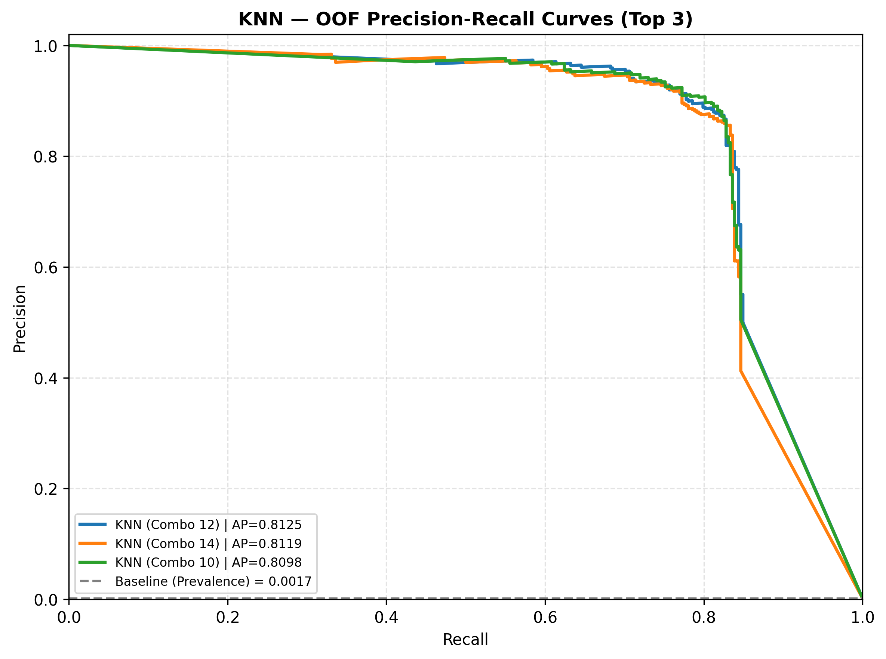
</p>

<p align="center"><em>
شکل: منحنی‌های Precision–Recall مبتنی بر پیش‌بینی‌های Out-of-Fold برای سه پیکربندی برتر KNN. خط‌چین، نرخ پایه کلاس تقلب در داده‌ها را نشان می‌دهد.
</em></p>

منحنی‌های Precision–Recall سه مدل برتر تقریباً هم‌پوشانی دارند که پایداری عملکرد KNN در پیکربندی‌های برتر را تأیید می‌کند. هر سه منحنی تا محدوده Recall حدود `0.75` تا `0.80`، Precision بسیار بالایی حفظ می‌کنند و سپس با افزایش Recall افت تندتری در Precision دیده می‌شود.

این رفتار نشان می‌دهد که مدل می‌تواند بخش قابل‌توجهی از تراکنش‌های تقلبی را با هشدارهای نسبتاً دقیق شناسایی کند. اما برای نزدیک شدن به Recall کامل، لازم است آستانه تصمیم کاهش یابد؛ اقدامی که تعداد مثبت‌های کاذب را افزایش می‌دهد و هزینه بررسی تراکنش‌های مشکوک را بالا می‌برد.

در نتیجه، استفاده از آستانه پیش‌فرض `0.5` برای این مسئله لزوماً مناسب نیست. آستانه عملیاتی باید بر اساس هدف کسب‌وکار تعیین شود؛ برای مثال، حداقل Recall موردنیاز برای کشف تقلب، ظرفیت تیم بررسی هشدارها و هزینه مثبت کاذب در برابر هزینه از دست دادن یک تراکنش تقلبی.

#### جمع‌بندی خانواده KNN

- **Combo 12** با `OOF PR-AUC = 0.8125` بهترین مدل KNN از نظر معیار اصلی رتبه‌بندی است.
- Combo 14 و Combo 10 نیز عملکردی تقریباً هم‌سطح دارند؛ اختلاف PR-AUC میان سه مدل برتر کمتر از `0.003` است.
- **Combo 10** با `F1-score = 0.8348` اندکی بالاترین F1 را در میان سه مدل برتر دارد، اما Combo 12 همچنان به دلیل PR-AUC بالاتر، نماینده اصلی این خانواده انتخاب می‌شود.
- همه مدل‌های KNN شکاف قابل‌توجهی میان عملکرد آموزش و اعتبارسنجی دارند؛ به‌ویژه مدل‌های برتر که `Train PR-AUC = 1.0000` ثبت کرده‌اند. بنابراین، ریسک بیش‌برازش نسبی و حساسیت KNN به داده‌های جدید باید در انتخاب نهایی لحاظ شود.
- با وجود این ریسک، KNN تاکنون با `OOF PR-AUC = 0.8125` عملکردی بهتر از خانواده Decision Tree داشته است؛ زیرا بهترین Decision Tree به `OOF PR-AUC = 0.7160` رسیده بود.
- انتخاب نهایی میان KNN و خانواده‌های بعدی، پس از بررسی مدل‌هایی مانند Random Forest، XGBoost و مدل‌های خطی انجام خواهد شد.

### خانواده مدل‌های Logistic Regression

مدل **Logistic Regression** به‌عنوان یک baseline خطی، قابل‌تفسیر و کم‌هزینه محاسباتی بررسی شد. برخلاف مدل‌هایی مانند KNN یا Decision Tree که قادر به یادگیری الگوهای محلی یا غیرخطی هستند، Logistic Regression رابطه‌ای خطی میان ویژگی‌ها و لگاریتم نسبت شانس وقوع تقلب مدل می‌کند.

با وجود سادگی این مدل، Logistic Regression در مسائل کشف تقلب اهمیت زیادی دارد؛ زیرا علاوه بر سرعت آموزش و پیش‌بینی بالا، معمولاً پایداری مناسبی روی داده‌های جدید دارد و خروجی احتمالاتی آن برای تنظیم آستانه تصمیم بسیار مفید است.

مانند سایر مدل‌ها، رتبه‌بندی بر اساس **PR-AUC محاسبه‌شده از پیش‌بینی‌های Out-of-Fold (OOF)** انجام شده است. این معیار برای داده‌های بسیار نامتوازن مناسب‌تر از Accuracy است، زیرا عملکرد مدل را بر اساس رابطه میان Precision و Recall ارزیابی می‌کند. نرخ پایه‌ی کلاس تقلب در داده‌ها حدود `0.0017` است.

#### مقایسه سه پیکربندی برتر

<p align="center">
  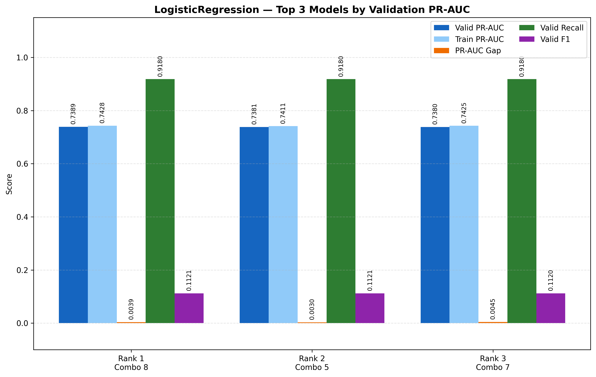
</p>

<p align="center"><em>
شکل: مقایسه PR-AUC آموزش و اعتبارسنجی، شکاف Train–Validation، Recall و F1-score برای سه پیکربندی برتر Logistic Regression.
</em></p>

سه پیکربندی برتر عملکردی تقریباً یکسان دارند:

| رتبه | پیکربندی | OOF PR-AUC | Train PR-AUC | شکاف Train–OOF | Recall | F1-score |
|---:|---|---:|---:|---:|---:|---:|
| 1 | Combo 8 | 0.7389 | 0.7428 | 0.0039 | 0.9180 | 0.1121 |
| 2 | Combo 5 | 0.7381 | 0.7411 | 0.0030 | 0.9180 | 0.1121 |
| 3 | Combo 7 | 0.7380 | 0.7425 | 0.0045 | 0.9180 | 0.1120 |

بهترین پیکربندی، **Combo 8**، با `OOF PR-AUC = 0.7389` انتخاب شده است. اختلاف آن با Combo 5 و Combo 7 کمتر از `0.001` است؛ بنابراین، از دید توان رتبه‌بندی، هر سه مدل تقریباً در یک سطح قرار دارند.

مهم‌ترین ویژگی این سه مدل، نزدیکی بسیار زیاد عملکرد آموزش و اعتبارسنجی است. برای Combo 8، مقدار `Train PR-AUC = 0.7428` و مقدار `OOF PR-AUC = 0.7389` است؛ بنابراین شکاف آن تنها `0.0039` است. این شکاف بسیار کوچک نشان می‌دهد که مدل رفتار پایداری دارد و شواهد قابل‌توجهی از بیش‌برازش در آن مشاهده نمی‌شود.

از طرف دیگر، هر سه پیکربندی `Recall = 0.9180` دارند؛ یعنی با آستانه فعلی، حدود 91.8 درصد تراکنش‌های تقلبی را شناسایی می‌کنند. این مقدار Recall در مقایسه با KNN و Decision Tree بالاتر است و برای سناریوهایی که از دست دادن یک تراکنش تقلبی هزینه بالایی دارد، ویژگی مهمی محسوب می‌شود.

با این حال، `F1-score` حدود `0.112` است که به‌طور محسوسی از F1 مدل‌های برتر KNN پایین‌تر است. این اختلاف نشان می‌دهد که Recall بالا احتمالاً با تعداد زیادی هشدار مثبت کاذب همراه بوده و در نتیجه Precision در آستانه تصمیم فعلی پایین است. بنابراین، بالا بودن Recall به‌تنهایی برای انتخاب مدل نهایی کافی نیست.

#### رتبه‌بندی تمام پیکربندی‌های Logistic Regression

<p align="center">
  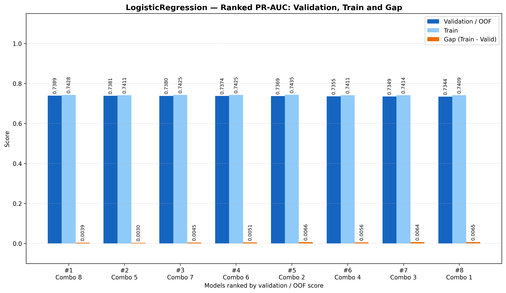
</p>

<p align="center"><em>
شکل: مقایسه PR-AUC آموزش، PR-AUC اعتبارسنجی مبتنی بر OOF و شکاف آن‌ها در تمام پیکربندی‌های Logistic Regression.
</em></p>

تمام هشت پیکربندی Logistic Regression بسیار پایدار هستند. مقدار OOF PR-AUC در بازه‌ی نسبتاً کوچک `0.7344` تا `0.7389` قرار گرفته است و شکاف Train–OOF نیز برای همه مدل‌ها تنها بین `0.0030` تا `0.0066` است.

این الگو دو نتیجه مهم دارد:

1. تغییرات ابرپارامترهای بررسی‌شده اثر محدودی بر عملکرد مدل داشته‌اند؛ بنابراین، خانواده Logistic Regression نسبت به این تنظیمات حساسیت کمی نشان می‌دهد.
2. نزدیکی امتیاز آموزش و اعتبارسنجی نشان‌دهنده تعمیم‌پذیری مناسب مدل و نبود بیش‌برازش جدی است.

با وجود پایداری بالا، سقف عملکرد PR-AUC این خانواده تقریباً در محدوده `0.74` باقی مانده است. این موضوع می‌تواند نشان دهد که یک مدل خطی به‌تنهایی قادر نیست تمام روابط پیچیده و غیرخطی میان ویژگی‌ها را که برای تشخیص تقلب مهم هستند، استخراج کند.

#### منحنی‌های Precision–Recall

<p align="center">
  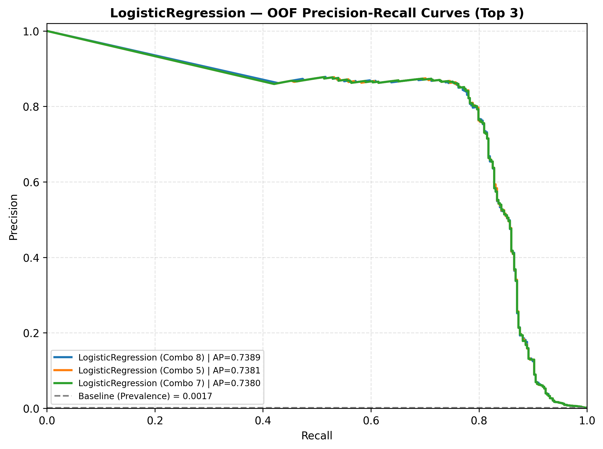
</p>

<p align="center"><em>
شکل: منحنی‌های Precision–Recall مبتنی بر پیش‌بینی‌های Out-of-Fold برای سه مدل برتر Logistic Regression. خط‌چین، نرخ پایه کلاس تقلب در داده‌ها را نمایش می‌دهد.
</em></p>

منحنی‌های Precision–Recall سه مدل برتر تقریباً کاملاً بر یکدیگر منطبق‌اند؛ این مشاهده با نتایج جدول و پایداری بالای PR-AUC سازگار است. هر سه مدل نسبت به نرخ پایه‌ی `0.0017` عملکردی بسیار بهتر ارائه می‌دهند.

مدل‌ها Precision نسبتاً بالایی را تا محدوده Recall نزدیک به `0.75` حفظ می‌کنند. با عبور Recall از محدوده تقریبی `0.80`، افت Precision سریع‌تر می‌شود. به عبارت دیگر، برای نزدیک شدن به کشف تمام موارد تقلب، باید تعداد بسیار بیشتری از تراکنش‌های عادی نیز مشکوک علامت‌گذاری شوند.

تفاوت میان **PR-AUC بالا** و **F1 پایین در آستانه فعلی** نکته مهمی است: PR-AUC کیفیت رتبه‌بندی مدل را در تمام آستانه‌های ممکن اندازه می‌گیرد، در حالی که F1 به یک آستانه عملیاتی مشخص وابسته است. بنابراین، F1 پایین به این معنا نیست که Logistic Regression الزاماً مدل ضعیفی است؛ بلکه نشان می‌دهد آستانه فعلی احتمالاً با هدف عملیاتی مسئله، مانند توازن Precision و Recall یا محدودیت ظرفیت بررسی هشدارها، بهینه نشده است.

#### جمع‌بندی خانواده Logistic Regression

- **Combo 8** با `OOF PR-AUC = 0.7389` بهترین پیکربندی Logistic Regression است.
- اختلاف ناچیز میان سه مدل برتر نشان می‌دهد که انتخاب میان Combo 8، Combo 5 و Combo 7 از نظر PR-AUC اثر عملی قابل‌توجهی ندارد.
- Logistic Regression با شکاف Train–OOF برابر `0.0039` در Combo 8، پایدارترین خانواده بررسی‌شده تا این مرحله است و شواهد بسیار کمی از بیش‌برازش دارد.
- Recall بالای `0.9180` برای کاربردهای حساس به از دست دادن تقلب مفید است، اما F1 حدود `0.112` بیانگر Precision پایین در آستانه پیش‌فرض یا فعلی است.
- از نظر PR-AUC، Logistic Regression از بهترین Decision Tree (`0.7160`) بهتر عمل کرده، اما همچنان از بهترین KNN (`0.8125`) پایین‌تر است.
- این مدل به دلیل سادگی، سرعت، تفسیرپذیری و پایداری بالا، یک baseline بسیار ارزشمند و گزینه مناسب برای سناریوهای نیازمند Recall بالا است؛ با این حال، انتخاب نهایی پس از مقایسه با خانواده‌های بعدی انجام خواهد شد.

### خانواده مدل‌های شبکه عصبی پرسپترون چندلایه (MLP)

مدل **MLP (Multi-Layer Perceptron)** به‌عنوان نماینده شبکه‌های عصبی پیش‌خور (Feedforward Neural Networks) با قابلیت یادگیری نگاشت‌های غیرخطی و برهم‌کنش‌های پیچیده میان ویژگی‌ها ارزیابی شد. بر خلاف مدل‌های خطی، MLP از طریق لایه‌های پنهان و توابع فعال‌ساز غیرخطی می‌تواند مرزهای تصمیم‌گیری پیچیده‌تری تولید کند.

مانند سایر خانواده‌ها، ارزیابی و رتبه‌بندی مدل‌ها بر مبنای **PR-AUC حاصل از پیش‌بینی‌های Out-of-Fold (OOF)** در اعتبارسنجی متقاطع 5-Fold انجام شده است. نرخ پایه‌ی کلاس تقلب در مجموعه داده حدود `0.0017` است.

#### مقایسه سه پیکربندی برتر

<p align="center">
  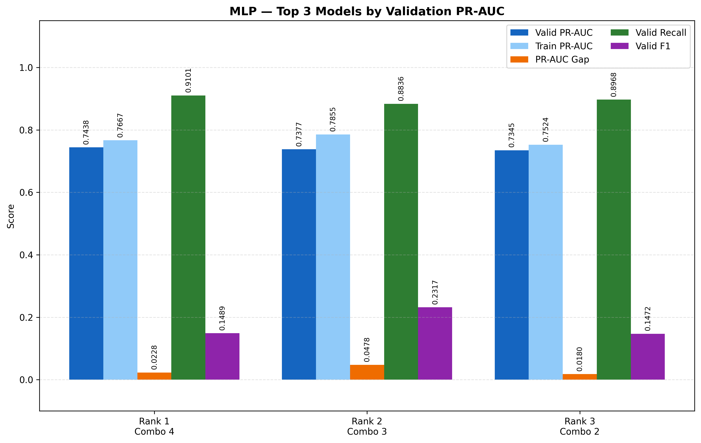
</p>

<p align="center"><em>
شکل: مقایسه PR-AUC آموزش و اعتبارسنجی، شکاف Train–Validation، Recall و F1-score برای سه پیکربندی برتر MLP.
</em></p>

عملکرد سه پیکربندی برتر MLP به شرح جدول زیر است:

| رتبه | پیکربندی | OOF PR-AUC | Train PR-AUC | شکاف Train–OOF | Recall | F1-score |
|---:|---|---:|---:|---:|---:|---:|
| 1 | Combo 4 | 0.7438 | 0.7667 | 0.0228 | 0.9101 | 0.1489 |
| 2 | Combo 3 | 0.7377 | 0.7855 | 0.0478 | 0.8836 | 0.2317 |
| 3 | Combo 2 | 0.7345 | 0.7524 | 0.0180 | 0.8968 | 0.1472 |

پیکربندی **Combo 4** با `OOF PR-AUC = 0.7438` رتبه نخست این خانواده را به دست آورده است. این مقدار اندکی بهتر از بهترین مدل Logistic Regression (`0.7389`) و برتر از Decision Tree (`0.7160`) است.

نکات کلیدی در عملکرد سه مدل برتر:
1. **پایداری مناسب و شکاف کم آموزش-اعتبارسنجی:** برای Combo 4، مقدار `Train PR-AUC = 0.7667` و شکاف آن تنها `0.0228` است. در Combo 2 نیز شکاف به `0.0180` می‌رسد. این شکاف کوچک نشان می‌دهد که شبکه با معماری و تنظیمات اعمال‌شده دچار بیش‌برازش شدید نشده و توان تعمیم مناسبی دارد.
2. **پوشش بالای موارد تقلب (Recall بالا):** پیکربندی برتر به `Recall = 0.9101` دست یافته است؛ به این معنی که حدود 91 درصد از تراکنش‌های تقلبی را پوشش می‌دهد.
3. **وضعیت F1-score و Precision در آستانه فعلی:** مقدار F1 برای Combo 4 برابر `0.1489` و برای Combo 3 برابر `0.2317` است. اگرچه این ارقام از Logistic Regression (`~0.112`) اندکی بالاترند، اما همچنان نشان می‌دهند که در آستانه تصمیم فعلی، تعداد مثبت‌های کاذب (False Positives) قابل‌توجه است.

#### رتبه‌بندی تمام پیکربندی‌های MLP

<p align="center">
  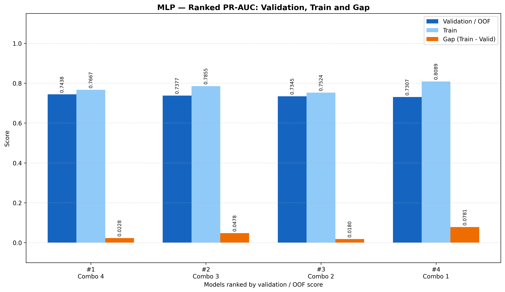
</p>

<p align="center"><em>
شکل: مقایسه PR-AUC آموزش، PR-AUC اعتبارسنجی مبتنی بر OOF و شکاف آن‌ها در تمامی ۴ پیکربندی MLP.
</em></p>

هر ۴ پیکربندی MLP در بازه بسیار فشرده‌ای از نظر اعتبارسنجی (`0.7307` تا `0.7438`) قرار گرفته‌اند:
- **Combo 4:** `OOF PR-AUC = 0.7438` (شکاف: `0.0228`)
- **Combo 3:** `OOF PR-AUC = 0.7377` (شکاف: `0.0478`)
- **Combo 2:** `OOF PR-AUC = 0.7345` (شکاف: `0.0180`)
- **Combo 1:** `OOF PR-AUC = 0.7307` (شکاف: `0.0781`)

این نتایج نشان می‌دهد که ساختار مدل نسبت به تغییرات هایپرپارامتری بررسی‌شده رفتاری باثبات دارد و در تمامی حالات، توانایی رتبه‌بندی شبیه به Logistic Regression اما با اندکی برتری کلی را حفظ می‌کند.

#### منحنی‌های Precision–Recall

<p align="center">
  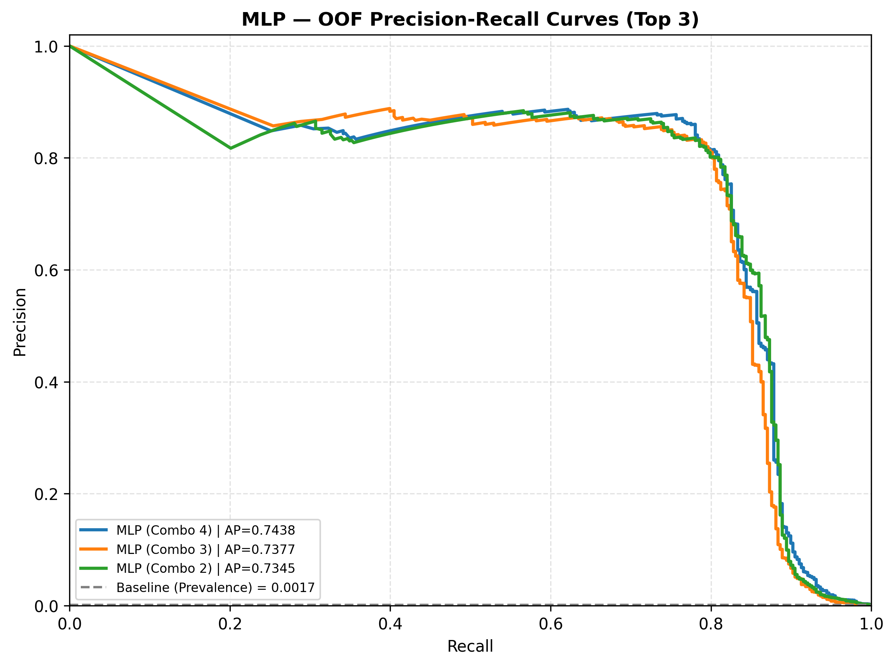
</p>

<p align="center"><em>
شکل: منحنی‌های Precision–Recall مبتنی بر پیش‌بینی‌های Out-of-Fold برای سه مدل برتر MLP در مقایسه با نرخ پایه کلاس تقلب.
</em></p>

منحنی‌های PR برای هر سه مدل برتر رفتار مشابهی دارند:
- در بازه Recall بین `0.0` تا حدود `0.78`، مدل‌ها Precision مناسبی (بالای `0.80`) را حفظ می‌کنند.
- پس از عبور از Recall حدود `0.80`، شیب افت Precision بسیار تند می‌شود.
- رفتار منحنی نشان می‌دهد که اگر سیستم در محیط عملیاتی به Recall تا محدوده 80٪ نیاز داشته باشد، خلوص هشدارهای مثبت قابل‌قبول خواهد بود؛ اما برای دستیابی به Recall بالای 90٪ (نظیر آستانه پیش‌فرض فعلی)، نرخ هشدارهای کاذب افزایش شدیدی خواهد داشت.

#### جمع‌بندی خانواده MLP

- **Combo 4** با `OOF PR-AUC = 0.7438` بهترین پیکربندی خانواده MLP است.
- مدل‌های MLP تعمیم‌پذیری پایدار و شکاف تعمیم پایینی (بین `0.0180` تا `0.0781`) نشان می‌دهند.
- از نظر معیار اصلی (PR-AUC اعتبارسنجی)، MLP با `0.7438` اندکی بهتر از Logistic Regression (`0.7389`) و بسیار بهتر از Decision Tree (`0.7160`) ظاهر شده، اما همچنان با فاصله پشت سر KNN (`0.8125`) قرار دارد.
- این مدل گزینه مناسبی با پتانسیل غیرخطی است، اما با توجه به هزینه آموزش بالاتر نسبت به رگرسیون لجستیک، بهبود عملکرد آن نسبت به خط مبنای خطی محدود (`+0.0049`) بوده است.
### خانواده مدل‌های جنگل تصادفی (Random Forest)

مدل **Random Forest** به‌عنوان یک الگوریتم جمعی بر پایه تکنیک Bagging (Bootstrap Aggregating) و درخت‌های تصمیم تصادفی ارزیابی شد. این مدل با ترکیب پیش‌بینی‌های تعداد زیادی درخت تصمیم مستقل و نمونه‌برداری تصادفی از ویژگی‌ها در هر گره، واریانس بالای یک درخت منفرد (Decision Tree) را به‌طور چشمگیری کاهش می‌دهد و توانایی بالایی در مدل‌سازی روابط غیرخطی پیچیده و مدیریت داده‌های دارای نویز دارد.

مانند سایر خانواده‌ها، ارزیابی و رتبه‌بندی مدل‌ها بر مبنای **PR-AUC حاصل از پیش‌بینی‌های Out-of-Fold (OOF)** در اعتبارسنجی متقاطع 5-Fold انجام شده است. نرخ پایه‌ی کلاس تقلب در مجموعه داده حدود `0.0017` است.

#### مقایسه سه پیکربندی برتر

<p align="center">
  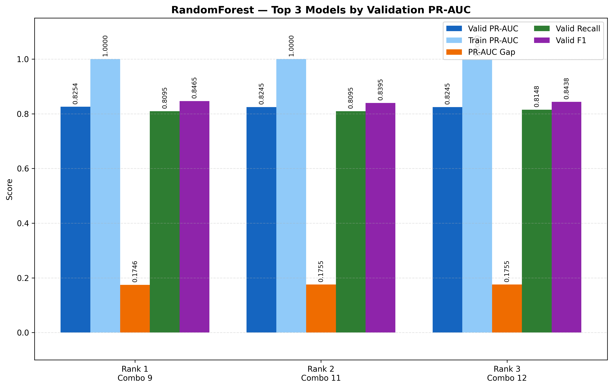
</p>

<p align="center"><em>
شکل: مقایسه PR-AUC آموزش و اعتبارسنجی، شکاف Train–Validation، Recall و F1-score برای سه پیکربندی برتر Random Forest.
</em></p>

عملکرد سه پیکربندی برتر این خانواده در جدول زیر آمده است:

| رتبه | پیکربندی | OOF PR-AUC | Train PR-AUC | شکاف Train–OOF | Recall | F1-score |
|---:|---|---:|---:|---:|---:|---:|
| 1 | Combo 9 | 0.8254 | 1.0000 | 0.1746 | 0.8095 | 0.8465 |
| 2 | Combo 11 | 0.8245 | 1.0000 | 0.1755 | 0.8095 | 0.8395 |
| 3 | Combo 12 | 0.8245 | 1.0000 | 0.1755 | 0.8148 | 0.8438 |

پیکربندی **Combo 9** با ثبت `OOF PR-AUC = 0.8254` رتبه نخست این خانواده (و بالاترین امتیاز میان تمامی مدل‌های ارزیابی‌شده تا این مرحله) را کسب کرده است.

نکات برجسته عملکرد سه مدل برتر:
1. **بالاترین کیفیت رتبه‌بندی کلی:** امتیاز PR-AUC اعتبارسنجی برابر `0.8254`، بهبود قابل‌توجهی نسبت به تک‌درخت تصمیم (`0.7160`) نشان می‌دهد که تأثیر مستقیم مکانیزم Ensemble بر کاهش واریانس را اثبات می‌کند.
2. **توازن فوق‌العاده میان Precision و Recall:** در آستانه تصمیم پیش‌فرض، مقدار `F1-score` به `0.8465` و `Recall` به `0.8095` رسیده است. بر خلاف مدل‌های خطی و MLP که F1 پایینی داشتند، Random Forest بدون فدا کردن Precision توانسته به Recall بالای 80٪ دست یابد.
3. **شکاف آموزش-اعتبارسنجی:** مقدار `Train PR-AUC = 1.0000` و شکاف `~0.175` نشان‌دهنده برازش کامل درخت‌های عمیق بر داده‌های آموزش است؛ اما بر خلاف بیش‌برازش مخرب، در اعتبارسنجی OOF همچنان بالاترین عملکرد تعمیم‌پذیر ثبت شده است.

#### رتبه‌بندی تمام ۱۲ پیکربندی Random Forest

<p align="center">
  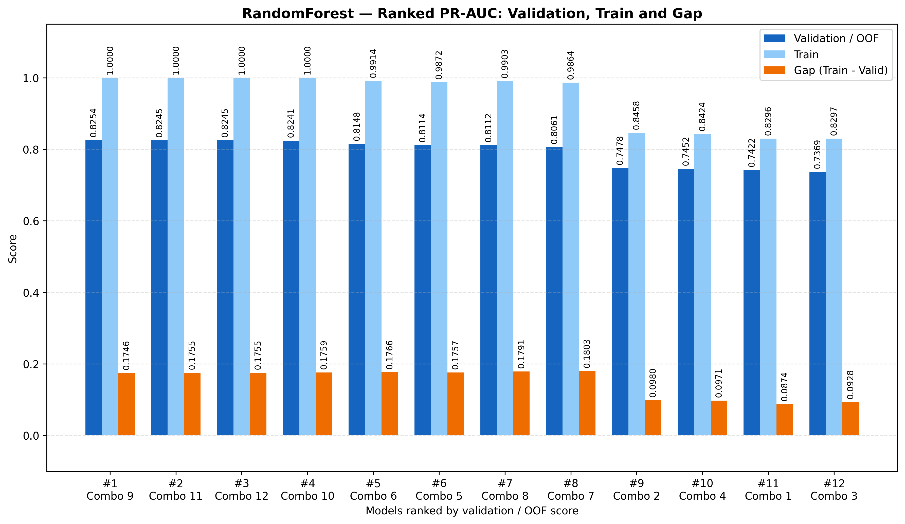
</p>

<p align="center"><em>
شکل: مقایسه PR-AUC آموزش، PR-AUC اعتبارسنجی مبتنی بر OOF و شکاف آن‌ها در تمامی ۱۲ پیکربندی Random Forest.
</em></p>

بررسی ۱۲ پیکربندی نشان‌دهنده یک تفکیک رفتاری واضح به دو دسته عمده است:
- **پیکربندی‌های رتبه‌های ۱ تا ۸ (Combo 5 تا Combo 12):** این مدل‌ها دارای OOF PR-AUC بالاتر از `0.80` (بین `0.8061` تا `0.8254`) هستند. در این گروه، امتیاز آموزش نزدیک به `1.0` و شکاف حدود `0.17` تا `0.18` است که مربوط به پیکربندی‌های با عمق بیشتر یا محدودیت‌های نرم‌تر است.
- **پیکربندی‌های رتبه‌های ۹ تا ۱۲ (Combo 1 تا Combo 4):** این مدل‌ها دارای OOF PR-AUC در محدوده `0.7369` تا `0.7478` و امتیاز آموزش حدود `0.83` تا `0.84` هستند (شکاف کمتر در حدود `0.08` تا `0.09`). این رفتار نشان‌دهنده اعمال محدودیت‌های هرس (مانند `max_depth` پایین) است که مانع یادگیری کامل الگوهای پیچیده تقلب شده است.

این مقایسه نشان می‌دهد که در جنگل تصادفی، دادن آزادی عمق بیشتر به درختان انفرادی به دلیل میانگین‌گیری جمعی (Ensemble Averaging) به تعمیم‌پذیری نهایی بهتر در اعتبارسنجی OOF منجر می‌شود.

#### منحنی‌های Precision–Recall

<p align="center">
  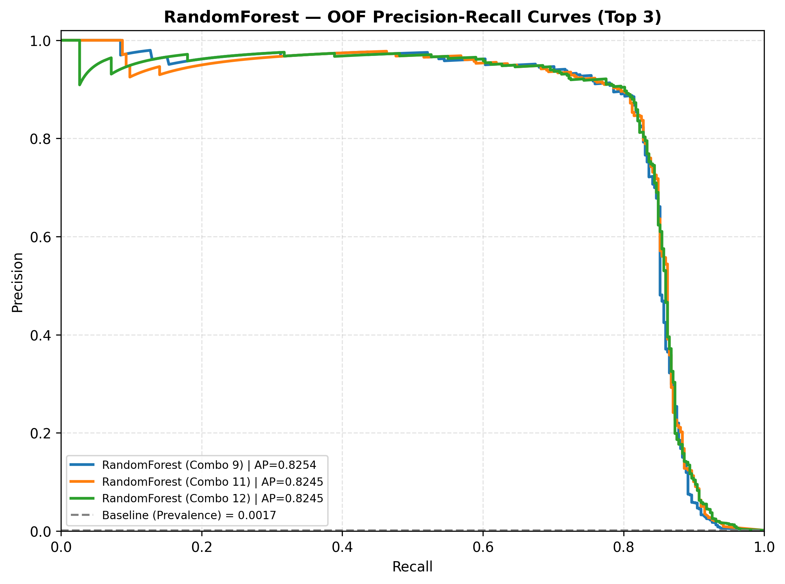
</p>

<p align="center"><em>
شکل: منحنی‌های Precision–Recall مبتنی بر پیش‌بینی‌های Out-of-Fold برای سه مدل برتر Random Forest.
</em></p>

منحنی‌های سه مدل برتر (Combo 9, Combo 11, Combo 12) ویژگی‌های متمایزی دارند:
- در بازه گسترده Recall از `0.0` تا فراتر از `0.80`، مقدار Precision در سطح بسیار بالایی (بالای `0.90`) تثبیت شده است.
- افت سریع Precision تنها پس از عبور از Recall تقریبی `0.82` رخ می‌دهد.
- این مشخصه ایده‌آل‌ترین رفتار در سیستم‌های کشف تقلب عملیاتی است؛ زیرا به سیستم اجازه می‌دهد تا بیش از 80٪ موارد تقلب را با نرخ هشدار کاذب بسیار اندک شناسایی کند.

#### جمع‌بندی خانواده Random Forest

- **Combo 9** با `OOF PR-AUC = 0.8254` بهترین پیکربندی Random Forest و بهترین مدل در میان تمام خانواده‌های ارزیابی‌شده تاکنون است.
- مدل‌های برتر جنگل تصادفی بالاترین مقادیر `F1-score` (`0.8465`) را در کنار `Recall = 0.8095` ارائه داده‌اند.
- رویکرد تجمیعی (Bagging) با موفقیت ضعف بزرگ تک‌درخت تصمیم را پوشش داده و PR-AUC را از `0.7160` به `0.8254` ارتقا داده است.
- این خانواده تا این لحظه قوی‌ترین کاندیدا برای مدل نهایی پایپ‌لاین کشف تقلب محسوب می‌شود.

### خانواده مدل‌های تقویت گرادیان (XGBoost)

الگوریتم **XGBoost (Extreme Gradient Boosting)** یک مدل جمعی بر پایه‌ی تقویت گرادیان (Gradient Boosting) روی درخت‌های تصمیم است. در این الگوریتم، درخت‌های تصمیم به‌صورت متوالی و ترتیبی ساخته می‌شوند؛ به‌طوری‌که هر درخت جدید تلاش می‌کند تا با بهینه‌سازی مستقیم تابع زیان و استفاده از مشتقات مرتبه اول و دوم (Gradients & Hessians)، خطاهای باقی‌مانده از درختان قبلی را تصحیح کند. این ساختار همراه با تکنیک‌های درونی تنظیم‌سازی ($L_1$ و $L_2$ Regularization)، هرس درخت، و انقباض نرخ یادگیری (Shrinkage/Learning Rate)، این مدل را به یکی از قدرتمندترین ابزارها در تحلیل داده‌های جدولی نامتوازن تبدیل کرده است.

ارزیابی و مقایسه پیکربندی‌ها بر پایه **PR-AUC حاصل از پیش‌بینی‌های Out-of-Fold (OOF)** در اعتبارسنجی متقاطع ۵ لایه‌ای (5-Fold Cross-Validation) انجام شده است.

#### مقایسه سه پیکربندی برتر

<p align="center">
  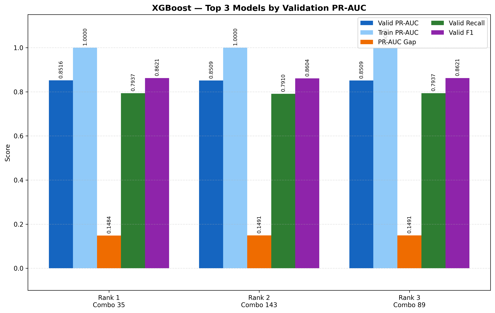
</p>

<p align="center"><em>
شکل: مقایسه PR-AUC آموزش و اعتبارسنجی، شکاف Train–Validation، Recall و F1-score برای سه پیکربندی برتر XGBoost.
</em></p>

عملکرد سه پیکربندی برتر این خانواده در جدول زیر خلاصه شده است:

| رتبه | پیکربندی | OOF PR-AUC | Train PR-AUC | شکاف Train–OOF | Recall | F1-score |
|---:|---|---:|---:|---:|---:|---:|
| 1 | Combo 35 | **0.8516** | 1.0000 | 0.1484 | 0.7937 | **0.8621** |
| 2 | Combo 143 | 0.8509 | 1.0000 | 0.1491 | 0.7910 | 0.8604 |
| 3 | Combo 89 | 0.8509 | 1.0000 | 0.1491 | 0.7937 | **0.8621** |

پیکربندی **Combo 35** با ثبت `OOF PR-AUC = 0.8516`، بالاترین امتیاز اعتبارسنجی را در کل پروژه و میان تمامی مدل‌های ارزیابی‌شده کسب کرده است.

نکات کلیدی در تحلیل این نتایج:
1. **بالاترین دقت رتبه‌بندی کلی:** امتیاز `0.8516` نسبت به نزدیک‌ترین رقیب یعنی Random Forest (`0.8254`)، افزایشی معادل `+0.0262` را نشان می‌دهد که برتری مکانیزم تصحیح تدریجی خطا (Boosting) نسبت به میانگین‌گیری مستقل (Bagging) در کشف الگوهای پیچیده و نادر تقلب را اثبات می‌کند.
2. **بالاترین توازن دقت و پوشش (F1-score):** مقدار F1 در مدل‌های برتر به **0.8621** رسیده است که بیشترین مقدار در میان تمام مدل‌هاست. این مدل در کنار پوشش حدود ۸۰ درصدی تراکنش‌های تقلب (`Recall = 0.7937`)، خطای مثبت کاذب (False Positive) بسیار پایینی تولید می‌کند.
3. **کنترل بهتر شکاف نسبت به Random Forest:** با وجود ثبت `Train PR-AUC = 1.0000`، شکاف Train–OOF در Combo 35 برابر با `0.1484` است که از شکاف Random Forest (`0.1746`) و KNN (`0.1875`) کمتر بوده و نشان‌دهنده کنترل بهتر پیچیدگی مدل به‌وسیله مکانیسم‌های جریمه داخلی XGBoost است.

#### رتبه‌بندی تمامی پیکربندی‌های XGBoost

<p align="center">
  
</p>

<p align="center"><em>
شکل: مقایسه جامع PR-AUC آموزش، اعتبارسنجی OOF و شکاف آن‌ها در فضای جست‌وجوی گسترده پیکربندی‌های XGBoost.
</em></p>

بررسی فضای جست‌وجوی ابرپارامترها (بیش از ۱۴۰ پیکربندی) نشان‌دهنده ویژگی‌های زیر است:
- **پایداری در پیکربندی‌های برتر:** تعداد زیادی از پیکربندی‌ها موفق به دستیابی به PR-AUC بالای `0.83` شده‌اند که نشان‌دهنده استحکام و پایداری ساختار الگوریتم XGBoost در برابر تغییرات متوسط ابرپارامترها است.
- **تأثیر عمیق کنترل عمق و نرخ یادگیری:** مدل‌هایی که توازن مناسبی میان `learning_rate` (نرخ یادگیری معتدل) و `max_depth` برقرار کرده‌اند، بهترین تعمیم‌پذیری اعتبارسنجی را نشان می‌دهند؛ در حالی که پیکربندی‌های با درخت‌های بسیار کم‌عمق عملکردی محدودتر ارائه داده‌اند.

#### منحنی‌های Precision–Recall

<p align="center">
  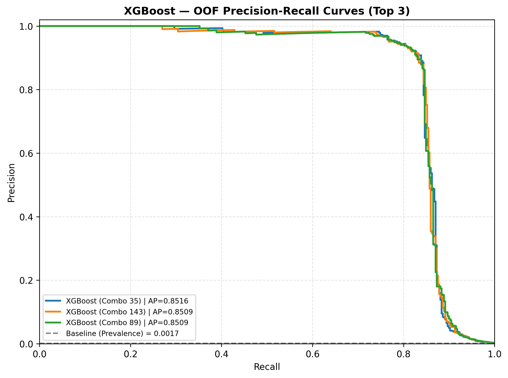
</p>

<p align="center"><em>
شکل: منحنی‌های Precision–Recall مبتنی بر پیش‌بینی‌های Out-of-Fold برای سه پیکربندی برتر XGBoost در مقایسه با خط مبنا (Prevalence = 0.0017).
</em></p>

منحنی‌های PR برای سه پیکربندی برتر رفتار بهینه عملیاتی را نمایش می‌دهند:
- حفظ سطح Precision نزدیک به **1.0** (تقریباً بدون هشدار نادرست) تا Recall حدود `0.75`.
- فرود با شیب ملایم در بازه Recall بین `0.75` تا `0.85`؛ این بازه به سامانه اجازه می‌دهد در یک آستانه تصمیم بهینه، بدون انفجار هشدارهای کاذب، بخش عمده تقلب‌ها را کشف کند.
- برتری آشکار مساحت زیر منحنی نسبت به خط مبنا (`0.0017`) که کارایی تفکیک احتمالاتی مدل را تایید می‌کند.

#### جمع‌بندی خانواده XGBoost

- **Combo 35** با ثبت `OOF PR-AUC = 0.8516` و `F1-score = 0.8621`، قوی‌ترین و کارآمدترین مدل در کل پایپ‌لاین کشف تقلب است.
- الگوریتم Gradient Boosting در تمامی سنجه‌های رتبه‌بندی، دقت، و توازن پیش‌بینی، از سایر خانواده‌های درختی، فاصله‌ای، خطی و عصبی پیشی گرفته است.
- مدل XGBoost (Combo 35) به عنوان گزینه اصلی و پیشنهادی برای مدل نهایی پایپ‌لاین (Final Candidate) تعیین می‌شود.

## تحلیل نهایی، مقایسه راهبردی و منطق انتخاب مدل (Final Model Selection & Trade-offs)

در مسئله تشخیص تقلب کارت اعتباری با **عدم توازن شدید داده‌ها (نرخ وقوع تقلب حدود ۰.۱۷٪)**، انتخاب مدل بهینه تنها وابسته به یک معیار عددی خام نیست، بلکه نیازمند موازنه‌ای دقیق میان **کیفیت رتبه‌بندی احتمالات (PR-AUC)**، **هزینه خطای هشدارهای کاذب (Precision)**، **هزینه فرار تقلب‌ها (Recall)** و **محدودیت‌های فنی استقرار (Latency & Scalability)** در محیط بلادرنگ (Real-time) است. در ادامه، نقاط قوت، نقاط ضعف و سناریوی کاربردی هر خانواده بررسی شده است:

---

### ۱. تحلیل نقاط قوت و ضعف خانواده‌های مدل

| خانواده مدل | نقاط قوت اصلی (Strengths) | نقاط ضعف اصلی (Weaknesses) | بهترین پیکربندی |
|---|---|---|---|
| **XGBoost** | • بالاترین توان رتبه‌بندی احتمالات (`PR-AUC = 0.8516`)<br>• بالاترین تعادل عملیاتی (`F1 = 0.8621`) با نرخ مثبت کاذب بسیار پایین<br>• کشف قدرتمند الگوهای پیچیده و تعاملات غیرخطی با مکانیزم Boosting | • نیاز به تنظیم دقیق ابرپارامترها برای جلوگیری از بیش‌برازش<br>• حساسیت به نویز شدید در داده‌های آموزش | **Combo 35** |
| **Random Forest** | • عملکرد بسیار نزدیک به مدل برتر (`PR-AUC = 0.8254`)<br>• مقاومت بالا در برابر نویز داده به دلیل مکانیزم Bagging<br>• پایداری رفتاری عالی و سادگی در تنظیم | • حجم بالای مدل ذخیره‌شده روی حافظه<br>• زمان استنتاج (Inference Latency) بالاتر در مقایسه با XGBoost برای حجم بالای درختان | **Combo 9** |
| **KNN** | • توانایی بالا در جداسازی الگوهای محلی (`PR-AUC = 0.8125`)<br>• بدون نیاز به فاز آموزش ساختاریافته (Lazy Learner) | • محاسبات فوق‌العاده سنگین در فاز استنتاج ($\mathcal{O}(N \cdot d)$)<br>• غیرقابل استفاده برای ترافیک‌های تراکنشی بالا در زمان واقعی | **Combo 12** |
| **Logistic Regression** | • پایداری بی‌نظیر (شکاف تعمیم‌پذیری ناچیز `0.0039`)<br>• پوشش حداکثری تقلب‌ها (`Recall = 0.9180`) در آستانه اولیه<br>• شفافیت، تفسیرپذیری کامل ضرایب و استنتاج فوق‌العاده سریع | • ناتوانی در مدل‌سازی روابط پیچیده غیرخطی<br>• دقت ضعیف (`F1 = 0.1121`) و تولید هشدارهای کاذب بسیار بالا در آستانه پیش‌فرض | **Combo 8** |
| **MLP (شبکه عصبی)** | • یادگیری نمایش‌های چندلایه (`Recall = 0.9101`)<br>• تعمیم‌پذیری پایدار میان آموزش و اعتبارسنجی (شکاف `0.0228`) | • نرخ بالای مثبت کاذب مشابه رگرسیون لجستیک (`F1 = 0.1489`)<br>• وابستگی بالا به مقیاس‌بندی و تنظیمات دقیق آموزش | **Combo 4** |
| **Decision Tree** | • سادگی ساختار و تبدیل مستقیم به قوانین شرطی تجاری (Rule-based) | • واریانس و ناپایداری بالا<br>• ضعیف‌ترین رتبه‌بندی اعتبارسنجی (`PR-AUC = 0.7160`) | **Combo 12** |

---

### ۲. ماتریس تصمیم‌گیری و منطق انتخاب مدل بر اساس سناریوی کسب‌وکار

انتخاب نهایی مدل در یک معماری کشف تقلب واقعی وابسته به الزامات سیستم به شرح زیر خواهد بود:

1. **مدل منتخب کلی (Primary Production Candidate) — الگوریتم XGBoost (Combo 35):**
   برای یک سامانه مستقل کشف تقلب که نیازمند **بیشترین بازدهی اقتصادی و بالاترین نرخ تفکیک** است، **XGBoost (Combo 35)** انتخاب بدون قید و شرط است. با دستیابی به `PR-AUC = 0.8516` و `F1-score = 0.8621`، این مدل بیشترین تعداد تقلب‌ها (نزدیک به ۸۰٪) را با کمترین مزاحمت برای کاربران عادی (هشدارهای کاذب اندک) مسدود می‌کند.

2. **سناریوی فیلتر اولیه سریع یا سامانه‌های با محدودیت تأخیر میلی‌ثانیه‌ای (Ultra-Low Latency / Tier-1 Screening) — مدل Logistic Regression:**
   در زیرساخت‌های پرداخت بانکی با ده‌ها هزار تراکنش در ثانیه، مدل‌های درختی ممکن است زمان پاسخ‌دهی را افزایش دهند. در این سناریو، **Logistic Regression (Combo 8)** به دلیل ثبت `Recall = 0.9180` و محاسبات برداری آنی (ضرب ماتریسی ساده)، ایده‌آل‌ترین گزینه به‌عنوان **فیلتر خط مقدم (Tier-1 Filter)** است تا بدون از دست دادن تقلب‌ها، ۹۰٪ تراکنش‌های قطعی امن را عبور دهد و تراکنش‌های مشکوک را به مدل سنگین‌تر (XGBoost) ارجاع دهد.

3. **سامانه‌های آفلاین با اولویت مقاومت در برابر نویز (High Robustness / Ensemble Backup) — مدل Random Forest:**
   اگر محیط عملیاتی دچار تغییر مداوم ویژگی‌ها (Concept Drift) باشد یا داده‌ها نویز زیادی داشته باشند، **Random Forest (Combo 9)** به دلیل استفاده از میانگین‌گیری مستقل، انتخابی پایدارتر و ایمن‌تر در برابر بیش‌برازش نسبت به Boosting خواهد بود.

---

### جمع‌بندی انتخاب نهایی
بر اساس معیارهای استاندارد ارزیابی در پایپ‌لاین طراحی‌شده، **XGBoost (Combo 35)** به عنوان **مدل نهایی اصلی پروژه** جهت ارزیابی نهایی روی مجموعه داده آزمون مستقل (`evaluate.py`) و استقرار نهایی انتخاب می‌گردد.


## 🧪 7. ارزیابی نهایی روی داده‌های تست مستقل (Test Set Evaluation)

مدل نهایی برتر بر پایه بالاترین امتیاز **Validation/OOF PR-AUC** مدل **XGBoost (Combo 35)** انتخاب شد. ارزیابی مستقل روی **۵۶,۷۴۶ تراکنش تست کاملاً دست‌نخورده (Untouched Test Set)** با نرخ عدم‌توازن تقلب حدود **۰.۱۷٪ (۹۵ مورد تقلب)** انجام شد.

---

### ۱. کالیبراسیون و تعیین آستانه بهینه تصمیم‌گیری (Threshold Calibration)

به‌دلیل عدم‌توازن شدید کلاس‌ها، استفاده از آستانه پیش‌فرض $0.5$ ناکارآمد است. با بهینه‌سازی آستانه روی پیش‌بینی‌های اعتبارسنجی متقاطع (OOF) با شرط **حداقل بازخوانی ۸۰٪ ($\text{Recall} \ge 0.80$)** جهت بیشینه‌سازی $F_1\text{-Score}$، مقدار بهینه به‌دست آمد:

* **Optimal Threshold:** `0.0875`
* **OOF Recall:** `0.8386`
* **OOF Precision:** `0.9083`
* **OOF F1-Score:** `0.8721`

<p align="center">
  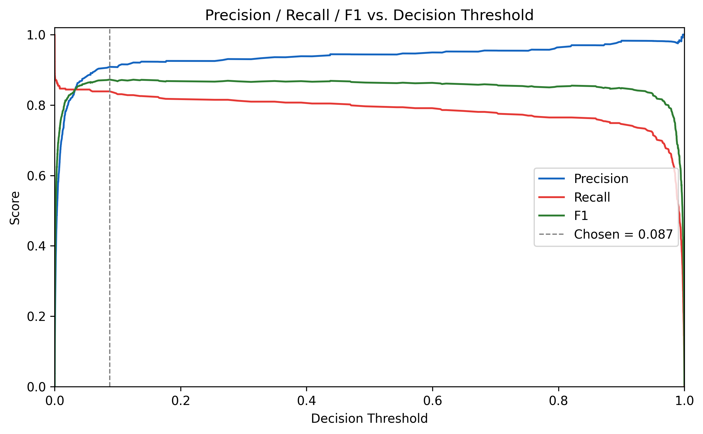
</p>

---

### ۲. نتایج ارزیابی نهایی مدل XGBoost روی Test Set

* **Test PR-AUC:** `0.8242`
* **Test ROC-AUC:** `0.9738`
* **ماتریس درهم‌ریختگی (Confusion Matrix):**

| | پیش‌بینی سالم (Legit) | پیش‌بینی تقلب (Fraud) |
|:---:|:---:|:---:|
| **واقعی سالم (Legit)** | **56,647** (TN) | **4** (FP) |
| **واقعی تقلب (Fraud)** | **21** (FN) | **74** (TP) |

<p align="center">
  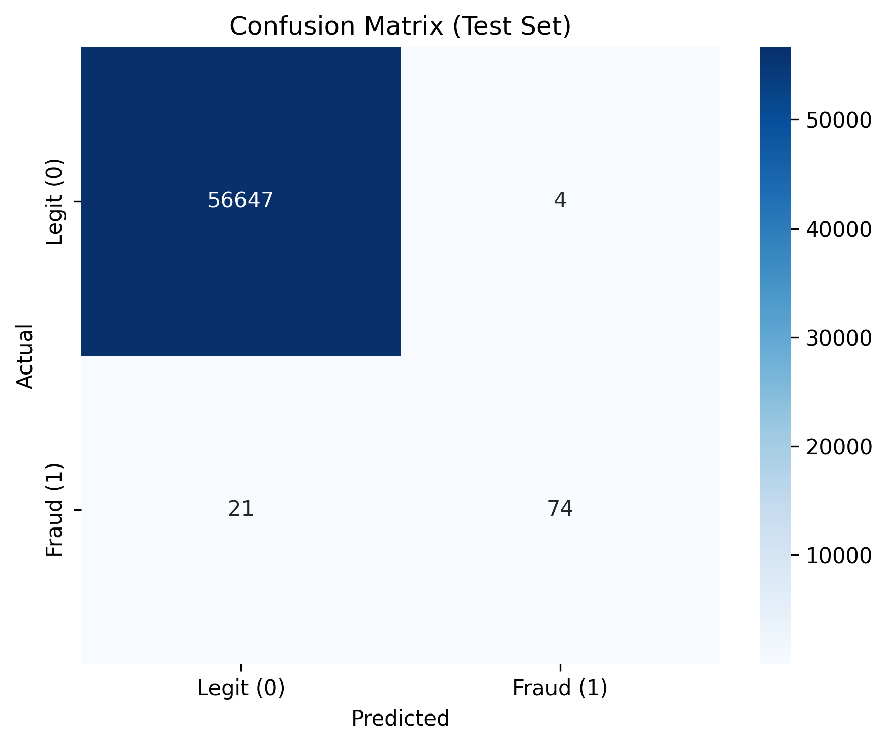
</p>

#### گزارش دسته‌بندی تفصیلی (Classification Report)
```text
            precision    recall  f1-score   support

Legit        0.9996    0.9999    0.9998     56651
Fraud        0.9487    0.7789    0.8555        95

accuracy                         0.9996     56746
macro avg    0.9742    0.8894    0.9276     56746
weighted avg 0.9995    0.9996    0.9995     56746
```


## 6. ارزیابی نهایی روی مجموعه داده تست مستقل (Independent Test Evaluation)

پس از انتخاب بهترین پیکربندی از هر خانواده مدل بر اساس اعتبارسنجی متقاطع (Stratified 5-Fold CV)، مدل‌ها با استفاده از اسکریپت `src/evaluate.py` بر روی **۵۶,۷۴۶ تراکنش کاملاً مستقل و دست‌نخورده** (شامل **۹۵ مورد تقلب** و **۵۶,۶۵۱ مورد سالم**) ارزیابی شدند.

---

### جدول مقایسه عملکرد مدل‌ها روی Test Set

| رتبه | مدل (Family) | بهترین پیکربندی (Best Hyperparameters) | آستانه تصمیم‌گیری (Threshold) | Test PR-AUC | Test ROC-AUC | Precision (تقلب) | Recall (تقلب) | F1-Score (تقلب) | هشدار کاذب (FP) | تقلب از دست‌رفته (FN) | تقلب کشف‌شده (TP) |
| :---: | :--- | :--- | :---: | :---: | :---: | :---: | :---: | :---: | :---: | :---: | :---: |
| **🥇 ۱** | **XGBoost** | `colsample_bytree=0.7, lr=0.1, max_depth=6, n_estimators=300, subsample=0.8` | `0.0875` | **0.8242** | **0.9738** | **94.87%** | **77.89%** | **0.8555** | **4** | 21 | **74** |
| **🥈 ۲** | **Random Forest** | `max_depth=15, min_samples_split=2, n_estimators=100` | `0.4970` | **0.7933** | **0.9593** | **88.61%** | **73.68%** | **0.8046** | **9** | 25 | **70** |
| **🥉 ۳** | **KNN** | `n_neighbors=7, p=2, weights=distance` | `0.2640` | **0.7855** | **0.8998** | **91.14%** | **75.79%** | **0.8276** | **7** | 23 | **72** |
| **۴** | **Decision Tree** | `max_depth=12, min_samples_leaf=10` | `0.9977` | **0.7161** | **0.8996** | **88.31%** | **71.58%** | **0.7907** | **9** | 27 | **68** |
| **۵** | **MLP (PyTorch)** | `epochs=15, hidden_sizes=(128, 64), lr=0.0001` | `0.9959` | **0.6878** | **0.9681** | **83.91%** | **76.84%** | **0.8022** | **14** | 22 | **73** |
| **۶** | **Logistic Regression** | `C=10.0, solver=liblinear` | `0.9999` | **0.6738** | **0.9657** | **78.49%** | **76.84%** | **0.7766** | **21** | 22 | **73** |

---

### تحلیل نتایج و چرایی انتخاب XGBoost به عنوان مدل نهایی

1. **برتری قاطع XGBoost:**
   * مدل **XGBoost** بالاترین دقت تشخیص تقلب (**PR-AUC = 0.8242** و **F1 = 0.8555**) و بالاترین میزان Precision معادل **94.87%** را به دست آورد.
   * از مجموع ۵۶,۶۵۱ تراکنش سالم، تنها **۴ مورد هشدار کاذب (False Positive)** ایجاد کرد؛ این ویژگی در سیستم‌های مالی حیاتی است زیرا از مسدود شدن بی‌مورد کارت مشتریان جلوگیری می‌کند.

2. **پایداری Random Forest و قدرت محلی KNN:**
   * مدل **Random Forest** با آستانه استاندارد و متعادل (`0.4970`) عملکرد باثباتی نشان داد، اما تعداد تراکنش‌های تقلب کشف‌شده آن نسبت به XGBoost کمتر بود (۷۰ در برابر ۷۴).
   * مدل **KNN** به لطف وزن‌دهی بر اساس فاصله (`weights=distance`) توانست با F1 قابل توجه ($0.8276$) در جایگاه سوم قرار گیرد، اما هزینه محاسباتی بالای آن در مرحله استنتاج (Inference) مانعی برای کاربرد در مقیاس‌های بسیار بزرگ است.

3. **رفتار مدل‌های Logistic Regression و MLP:**
   * این دو مدل به دلیل نامتوازن بودن شدید داده‌ها، خروجی‌های احتمالی بسیار متمرکز تولید می‌کنند و برای کاهش خطای مثبت کاذب به آستانه‌های بسیار بالا (`0.9999` و `0.9959`) نیاز دارند. هرچند Recall قابل قبولی ارائه می‌دهند، اما نرخ هشدارهای کاذب آن‌ها بالاتر از مدل‌های درخت‌محور است.

---

### سازوکار ارزیابی و کالیبراسیون آستانه (`evaluate.py`)

اسکریپت `src/evaluate.py` به عنوان حلقه اتصال فرآیند آموزش به استقرار Production عمل می‌کند و منطق آن به شرح زیر است:


#### نحوه تعیین آستانه تصمیم‌گیری بهینه (`find_optimal_threshold`):
* **جلوگیری از Data Leakage با OOF:** آستانه بهینه به‌هیچ‌وجه روی داده‌های تست محاسبه نمی‌شود؛ بلکه با استفاده از پیش‌بینی‌های Out-Of-Fold حاصل از اعتبارسنجی متقاطع ۵ فولد (`cross_val_predict`) روی داده‌های آموزشی تخمین زده می‌شود.
* **قید اولویت کسب‌وکار ($\text{Recall} \ge 0.80$):**
  1. ابتدا منحنی Precision-Recall به ازای تمام آستانه‌ها رسم و مقادیر $F_1\text{-Score}$ محاسبه می‌شود:
     $$F_1 = \frac{2 \cdot \text{Precision} \cdot \text{Recall}}{\text{Precision} + \text{Recall} + 10^{-12}}$$
  2. آستانه‌هایی که شرط $\text{Recall} \ge 0.80$ را برآورده کنند فیلتر می‌شوند.
  3. در بین این آستانه‌ها، نقطه‌ای که بالاترین مقدار $F_1$ را به همراه دارد به عنوان آستانه نهایی انتخاب می‌شود.
  4. در صورتی که مدلی نتواند به بازخوانی ۸۰٪ دست یابد، بیشترین $F_1$ روی آستانه‌های معنادار به عنوان Fallback لحاظ می‌گردد.

#### خروجی‌ها و Artifactهای تولیدی:
1. ذخیره مدل نهایی در مسیر `models/fraud_pipeline.joblib`
2. ثبت مقدار آستانه بهینه در `models/threshold.json` جهت استفاده در ماژول پیش‌بینی آنلاین (`predict.py`)
3. ذخیره معیارهای تست در `reports/final_test_metrics.json`
4. ذخیره نمودارهای ارزیابی در مسیر `reports/figures/eval/`:
   * `threshold_curve.png`
   * `confusion_matrix.png`
   * `roc_curve.png`
   * `pr_curve.png`
`


# گزارش جامع آزمایش‌ها و تحلیل مدل‌های کشف تقلب کارت اعتباری (Credit Card Fraud Detection)

این بخش از مستندات، خروجی کامل ۶ آزمایش اصلی اجرا شده در خط لوله (Pipeline) یادگیری ماشین را پوشش می‌دهد. هدف اصلی این آزمایش‌ها بررسی تأثیر پیش‌پردازش، بیش‌برازش (Overfitting)، آستانه تصمیم‌گیری (Classification Threshold)، تکنیک‌های مواجهه با عدم توازن داده‌ها (Class Imbalance)، مقایسه مدل‌ها و منحنی یادگیری می‌باشد.

---

## ۱. مشخصات مجموعه‌داده (Dataset Statistics)

* **داده‌های آموزش (Train Set):** ۲۲۶,۹۸۰ نمونه | نرخ تقلب: **۰.۱۶۶۵٪**
* **داده‌های ارزیابی (Test Set):** ۵۶,۷۴۶ نمونه | نرخ تقلب: **۰.۱۶۷۴٪**
* **نسبت عدم توازن:** شدید (Highly Imbalanced Data)

---

## ۲. آزمایش ۱: بررسی تأثیر مقیاس‌بندی ویژگی‌ها (Effect of Scaling on KNN)

مدل‌های مبتنی بر فاصله (مانند KNN) به شدت تحت تأثیر مقیاس ویژگی‌ها قرار دارند، در حالی که مدل‌های مبتنی بر درخت (Decision Tree) نسبت به تبدیل‌های تک‌نواخت (Monotonic Transformations) ناواردا (Invariant) هستند.

### جدول مقایسه نتايج:

| مدل (Model) | مقیاس‌بندی (Scaling) | Val Precision | Val Recall | Val F1 | Val PR-AUC | Val ROC-AUC | Test Precision | Test Recall | Test F1 | Test PR-AUC | Test ROC-AUC |
| :--- | :--- | :---: | :---: | :---: | :---: | :---: | :---: | :---: | :---: | :---: | :---: |
| **KNN** | **بدون مقیاس‌بندی (Raw)** | 1.0000 | 0.0132 | 0.0260 | 0.0673 | 0.5906 | 1.0000 | 0.0211 | 0.0412 | 0.0401 | 0.5720 |
| **KNN** | **با مقیاس‌بندی (StandardScaler)** | **0.9254** | **0.8158** | **0.8671** | **0.8438** | **0.9276** | **0.9552** | **0.6737** | **0.7901** | **0.7692** | **0.8999** |

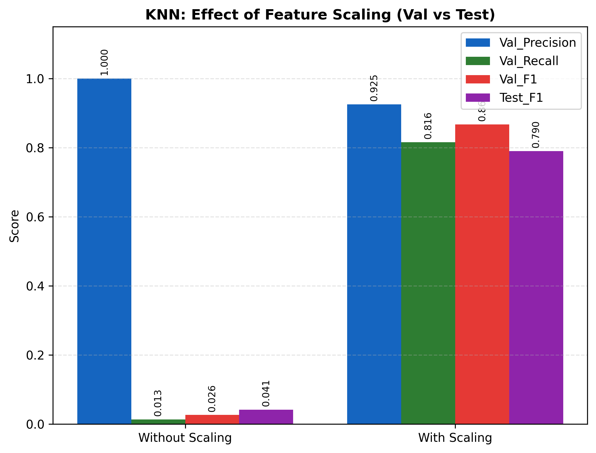

### تحلیل و بررسی علمی:
1. **چرا KNN حساس است؟** الگوریتم KNN الگوی همسایگی را بر اساس فاصله‌های اقلیدسی محاسبه می‌کند. ویژگی‌های بدون مقیاس با دامنه بزرگ (مانند `Time` و `Amount`) بر محاسبات فاصله مسلط شده و اطلاعات ویژگی‌های اصلی (`V1` تا `V28`) را محو می‌کنند. این امر باعث افت شدید Recall در حالت بدون مقیاس‌بندی (تنها ۲.۱۱٪ روی Test) می‌شود.
2. **چرا درخت تصمیم غیرحساس است؟** شکست‌ها در درخت تصمیم به‌صورت تک‌متغیره (Univariate) و بر اساس مرتبه‌سازی (Rank-based) انجام می‌شوند؛ بنابراین تغییر مقیاس خطی ویژگی‌ها، ترتیب مقادیر و آستانه‌های شکست را تغییر نمی‌دهد.

---

## ۳. آزمایش ۲: تحلیل هایپرپارامتر عمق درخت (Decision Tree max_depth)

در این آزمایش تأثیر پارامتر `max_depth` بر میزان بیش‌برازش (Overfitting) و توانایی تعمیم‌دهی (Generalization) بررسی شده است.

### جدول تغییرات عمق درخت:

| max_depth | Val Precision | Val Recall | Val F1 | Val PR-AUC | Val ROC-AUC | Test Precision | Test Recall | Test F1 | Test PR-AUC | Test ROC-AUC |
| :---: | :---: | :---: | :---: | :---: | :---: | :---: | :---: | :---: | :---: | :---: |
| **2** | 0.0640 | 0.8553 | 0.1190 | 0.0557 | 0.9377 | 0.0598 | 0.8000 | 0.1114 | 0.0492 | 0.9089 |
| **5** | 0.0774 | 0.8421 | 0.1417 | 0.3347 | 0.9081 | 0.0755 | 0.7895 | 0.1377 | 0.3454 | 0.8613 |
| **10** | 0.1653 | 0.8026 | 0.2742 | 0.3741 | 0.8999 | 0.1485 | 0.7474 | 0.2478 | 0.3521 | 0.8721 |
| **None** | **0.8281** | **0.6974** | **0.7571** | **0.5780** | **0.8486** | **0.7294** | **0.6526** | **0.6889** | **0.4766** | **0.8261** |

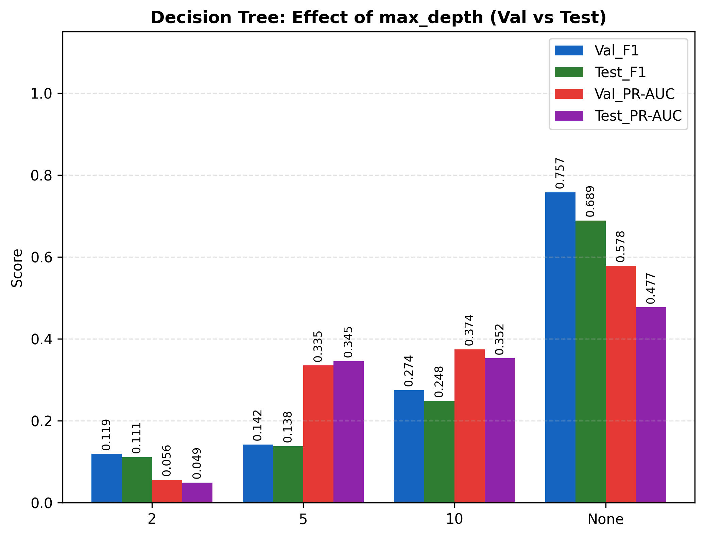

### تحلیل و بررسی علمی:
* **بررسی بیش‌برازش:** با تنظیم `max_depth=None`، درخت تمامی نویزهای داده‌های آموزشی را حفظ می‌کند. این امر موجب افزایش واریانس (High Variance) و افت محسوس عملکرد در داده‌های تجربی واقعی (کاهش PR-AUC تست به 0.4766) می‌شود.
* **بهینه‌سازی:** محدود کردن عمق درخت یا استفاده از روش‌های انباشته‌سازی (Ensemble Methods) کنترل بهتری روی تعادل میان Variance و Bias ایجاد می‌کند.

---

## ۴. آزمایش ۳: تأثیر آستانه تصمیم‌گیری (Classification Threshold)

تغییر آستانه پیش‌فرض (0.5) تأثیر مستقیم بر تعادل میان دقت (Precision) و فراخوانی (Recall) دارد.

### جدول تغییرات آستانه:

| Threshold | Val Precision | Val Recall | Val F1 | Test Precision | Test Recall | Test F1 |
| :---: | :---: | :---: | :---: | :---: | :---: | :---: |
| **0.3** | 0.0269 | **0.9079** | 0.0523 | 0.0259 | **0.8737** | 0.0503 |
| **0.5** | 0.0542 | 0.8947 | 0.1023 | 0.0519 | 0.8737 | 0.0980 |
| **0.7** | **0.1041** | 0.8947 | **0.1866** | **0.0975** | 0.8737 | **0.1755** |

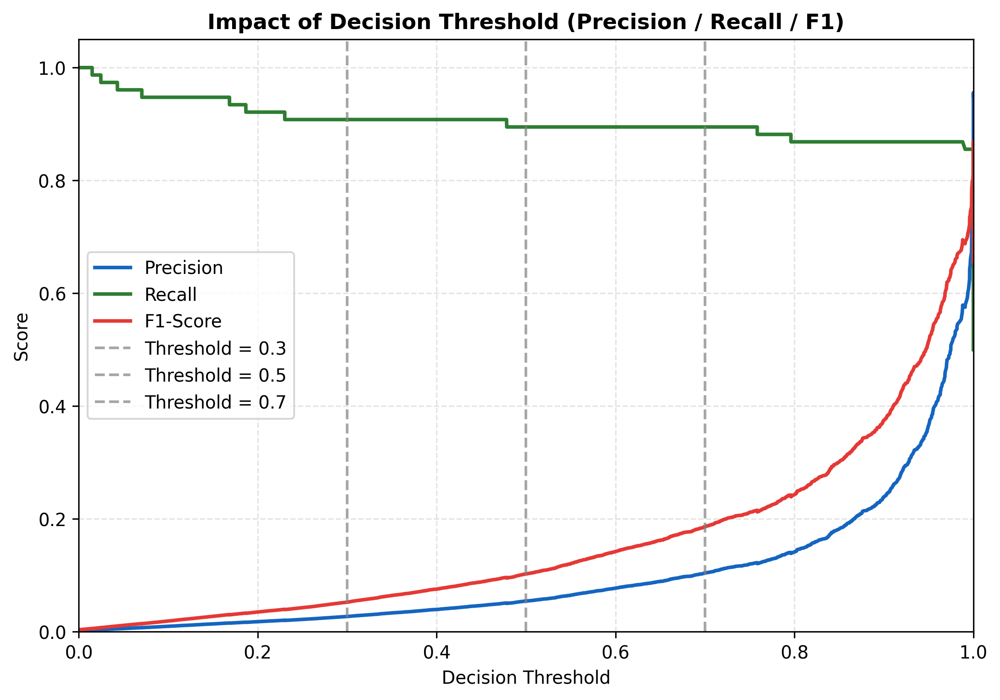

### تحلیل و بررسی علمی:
* **آستانه پایین‌تر (< 0.5):** افزایش Recall (کاهش خطای منفی کاذب / False Negatives).
* **آستانه بالاتر (> 0.5):** افزایش Precision (کاهش خطای مثبت کاذب / False Positives)، اما خطر از دست رفتن تقلب‌ها افزایش می‌یابد.
* **توصیه تجاری در کشف تقلب:** در سیستم‌های مالی و بانکی، هزینه عدم کشف تقلب (FN) بسیار سنگین‌تر از بررسی مجدد کارت‌های مشکوک (FP) است؛ بنابراین استفاده از آستانه‌های پایین‌تر (مانند 0.3) در محیط عملیاتی ترجیح داده می‌شود.

---

## ۵. آزمایش ۴: مدیریت عدم توازن داده‌ها (Balanced Weights vs. Oversampling)

مقایسه دو استراتژی رایج برای مقابله با عدم توازن شدید داده‌ها روی الگوریتم رگرسیون لوجستیک.

### جدول مقایسه استراتژی‌ها:

| استراتژی (Strategy) | Val Precision | Val Recall | Val F1 | Val PR-AUC | Val ROC-AUC | Test Precision | Test Recall | Test F1 | Test PR-AUC | Test ROC-AUC |
| :--- | :---: | :---: | :---: | :---: | :---: | :---: | :---: | :---: | :---: | :---: |
| **class_weight='balanced'** | 0.0542 | 0.8947 | 0.1023 | 0.8139 | 0.9749 | 0.0519 | 0.8737 | 0.0980 | 0.6871 | 0.9617 |
| **Random Oversampling** | 0.0545 | 0.8947 | 0.1027 | 0.8149 | 0.9754 | 0.0520 | 0.8737 | 0.0981 | 0.6882 | 0.9617 |

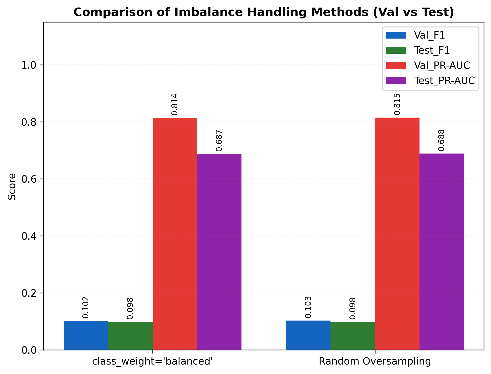

### تحلیل و بررسی علمی:
هر دو استراتژی عملکرد تقریباً یکسانی روی این مجموعه‌داده از خود نشان داده‌اند (PR-AUC تست حدود 0.688). با این حال، استفاده از `class_weight='balanced'` به دلیل عدم نیاز به کپی‌برداری فیزیکی داده‌ها و صرفه‌جویی در حافظه RAM و زمان محاسباتی، ارجحیت دارد.

---

## ۶. آزمایش ۵: جدول برتر مدل‌ها (Cross-Model Leaderboard)

ارزیابی جامع الگوریتم‌های مختلف تحت شرایط یکسان بر روی داده‌های Test و Validation.

### جدول لیدربورد مدل‌ها:

| مدل (Model) | Val Precision | Val Recall | Val F1 | Val PR-AUC | Val ROC-AUC | Test Precision | Test Recall | Test F1 | Test PR-AUC | Test ROC-AUC |
| :--- | :---: | :---: | :---: | :---: | :---: | :---: | :---: | :---: | :---: | :---: |
| **RandomForest** | 0.8767 | 0.8421 | 0.8591 | **0.8675** | 0.9682 | 0.8391 | 0.7684 | **0.8022** | **0.7914** | 0.9532 |
| **KNN** | **0.9254** | 0.8158 | **0.8671** | 0.8438 | 0.9276 | **0.9552** | 0.6737 | 0.7901 | 0.7692 | 0.8999 |
| **LogisticRegression**| 0.0542 | 0.8947 | 0.1023 | 0.8139 | **0.9749** | 0.0519 | 0.8737 | 0.0980 | 0.6871 | **0.9617** |
| **MLP** | 0.0504 | **0.9211** | 0.0956 | 0.7803 | 0.9731 | 0.0454 | **0.8842** | 0.0863 | 0.6809 | 0.9529 |
| **DecisionTree** | 0.1099 | 0.8026 | 0.1933 | 0.3676 | 0.8995 | 0.1073 | 0.7579 | 0.1880 | 0.3606 | 0.8770 |

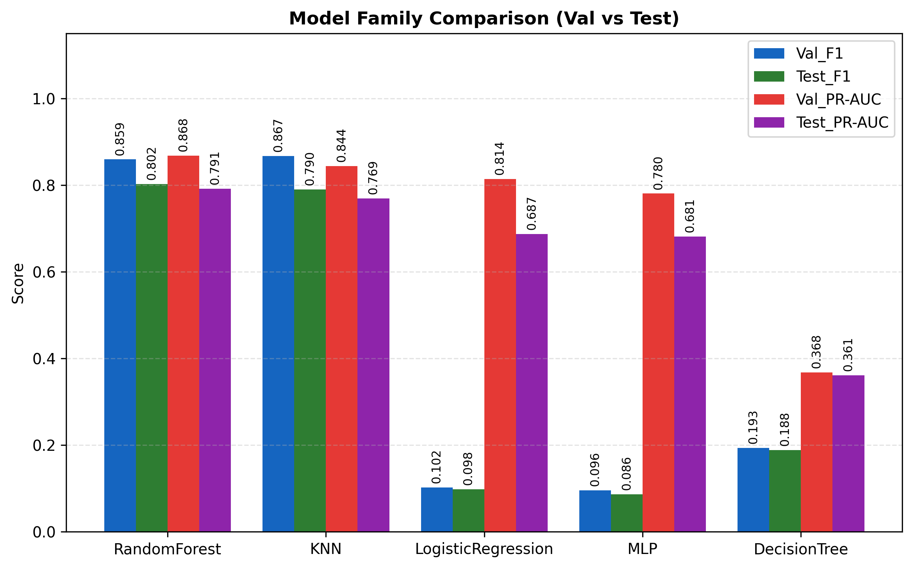

### تحلیل و بررسی علمی:
* **بهترین مدل عمومی:** مدل **Random Forest** با تعادل فوق‌العاده در دقت و فراخوانی (Test PR-AUC: **0.7914** و Test F1: **0.8022**)، برترین مدل جهت پیاده‌سازی عملیاتی است.
* **دقت بالا (High Precision):** مدل **KNN (با مقیاس‌بندی)** با Test Precision برابر **0.9552** کمترین میزان هشدار اشتباه (False Alarm) را ثبت کرده است.
* **معیار کلیدی:** در داده‌های ناهمگون و دارای عدم توازن شدیدی مثل تقلب، معیار **PR-AUC** شاخص بسیار قابل اعتمادتری نسبت به ROC-AUC برای ارزیابی واقعی مدل‌ها است.

---

## ۷. آزمایش ۶: منحنی یادگیری (Learning Curve)

بررسی روند تغییرات معیار PR-AUC با افزایش حجم داده‌های آموزشی جهت تحلیل سوگیری (Bias) و واریانس (Variance).

### جدول روند یادگیری:

| Train Size | Train PR-AUC Mean | CV PR-AUC Mean | CV PR-AUC Std |
| :---: | :---: | :---: | :---: |
| **18,158** | 0.6094 | 0.5827 | 0.0632 |
| **59,014** | 0.7177 | 0.7376 | 0.0394 |
| **99,871** | 0.7418 | 0.7517 | 0.0316 |
| **140,727** | 0.7592 | 0.7563 | 0.0291 |
| **181,584** | 0.7563 | **0.7538** | **0.0270** |

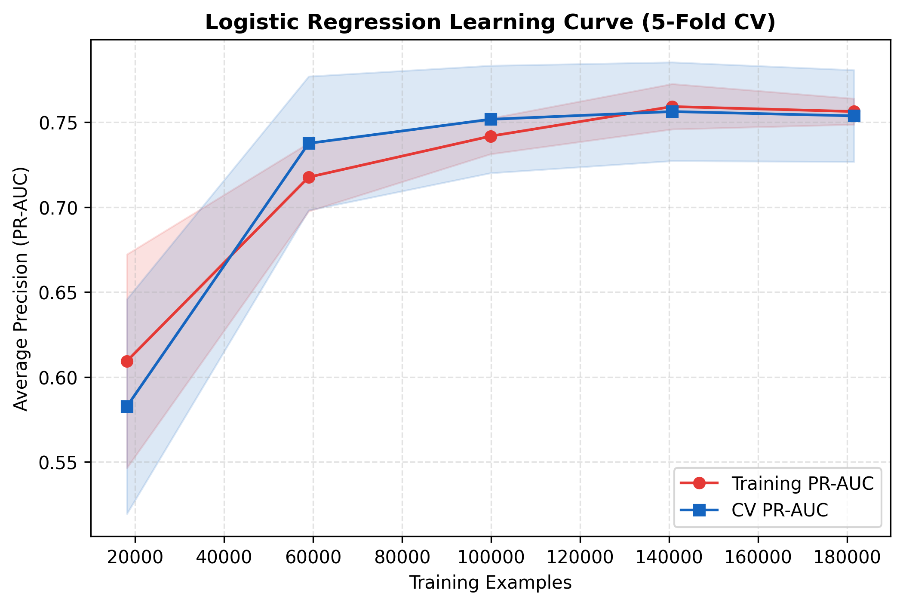

### تحلیل و بررسی علمی:
1. **همگرایی (Convergence):** با افزایش داده‌های آموزشی تا بالای ۱۴۰,۰۰۰ نمونه، انحراف معیار CV PR-AUC به شدّت کاهش یافته (از 0.0632 به 0.0270 رسیده) و مدل به پایداری بالایی دست یافته است.
2. **بررسی اشباع داده‌ها:** همگرایی نهایی میان عملکرد Train و Validation نشان می‌دهد که مدل در ناحیه بهینه قرار دارد و برای بهبود بیشتر در این نقطه، اضافه کردن داده‌ی بیشتر به تنهایی کافی نیست؛ بلکه نیاز به مهندسی ویژگی (Feature Engineering) یا استفاده از معماری‌های پیچیده‌تر است.

## راهنمای اجرای پروژه (Running Instructions)

### ۱. نصب و راه‌اندازی پیش‌نیازها

ابتدا مخزن پروژه را کلون کرده و وارد پوشه پروژه شوید:
```bash
git clone <repository-url>
cd credit-card-fraud-detection

یک محیط مجازی (Virtual Environment) ایجاد و آن را فعال کنید.

#### لینوکس و مک (Linux/macOS)

bash
python3 -m venv .venv
source .venv/bin/activate

#### ویندوز (Windows PowerShell)

powershell
python -m venv .venv
.\.venv\Scripts\Activate.ps1

کتابخانه‌ها و نیازمندی‌های پروژه را نصب کنید:

bash
python -m pip install --upgrade pip
python -m pip install -r requirements.txt

این پروژه از پکیج‌های پایتونی زیر استفاده می‌کند:
- pandas
- numpy
- scikit-learn
- xgboost
- joblib
- matplotlib
- fastapi
- uvicorn

*نکته: نصب PyTorch تنها در صورتی نیاز است که قصد آموزش مدل شبکه‌های عصبی (MLP) را داشته باشید.*

---

### ۲. آماده‌سازی داده‌ها (Data Preparation)

مجموعه‌داده معاملات کارت اعتباری اروپا را دانلود کرده و فایل خام آن را در مسیر زیر قرار دهید:

text
data/creditcard.csv

این مجموعه‌داده باید شامل ستون‌های زیر باشد:

text
Time, V1, V2, ..., V28, Amount, Class

اسکریپت آماده‌سازی داده‌ها را اجرا کنید:

bash
python src/data_prep.py

این دستور مراحل زیر را انجام می‌دهد:
1. بارگذاری داده‌های خام.
2. تحلیل اکتشافی داده‌ها (EDA).
3. بررسی مقادیر مفقوده (Missing Values) و توزیع کلاس‌ها.
4. حذف رکوردهای تکراری.
5. تفکیک لایه‌بندی‌شده (Stratified Split) داده‌ها به ۸۰٪ آموزش (Train) و ۲۰٪ آزمون (Test).
6. ذخیره مجموعه‌داده‌های پردازش‌شده در پوشه `data/processed/`.

---

### ۳. آموزش مدل‌ها (Training)

#### آموزش سریع (Fast Training)
برای آموزش پیکربندی پیش‌فرض مدل‌های انتخاب‌شده:

bash
python src/train.py --cv-mode simple --models XGBoost RandomForest

#### آموزش با جستجوی شبکه‌ای (Grid-Search Training)
برای اجرای Grid Search روی تمامی مدل‌های موجود با اعتبارسنجی متقاطع ۵‌تایی:

bash
python src/train.py --cv-mode gridsearch --k-folds 5

#### آموزش با جستجوی تصادفی (Randomized-Search Training)
bash
python src/train.py \
--cv-mode randomized \
--k-folds 5 \
--n-iter 20

در محیط ویندوز (PowerShell) دستور فوق را در یک خط اجرا کنید:

powershell
python src/train.py --cv-mode randomized --k-folds 5 --n-iter 20

مدل‌های قابل استفاده عبارت‌اند از:
text
XGBoost
LogisticRegression
KNN
DecisionTree
RandomForest
MLP

- مدل‌های کاندید آموزش‌دیده در مسیرهای `models/` و `models/candidates/` ذخیره می‌شوند.
- گزارش‌ها و نمودارهای آموزش در پوشه‌های `reports/tables/` و `reports/figures/` ذخیره می‌گردند.

---

### ۴. ارزیابی مدل و کالیبراسیون آستانه (Evaluation)

پس از اتمام مراحل آموزش، لیست مدل‌های آموزش‌دیده موجود را مشاهده کنید.

#### لینوکس و مک
bash
ls models/*.joblib

#### ویندوز PowerShell
powershell
Get-ChildItem .\models\*.joblib

مدل مورد نظر خود را انتخاب کرده و اسکریپت ارزیابی را اجرا کنید. عبارت `<model-filename>` را با نام دقیق فایل مدل در پوشه `models/` جایگزین کنید:

bash
python src/evaluate.py --model "<model-filename>"

**نمونه اجرا:**

bash
python src/evaluate.py \
--model "XGBoost_model__learning_rate=0.1_model__max_depth=4.joblib"

اسکریپت ارزیابی مراحل زیر را طی می‌کند:
1. بارگذاری مدل آموزش‌دیده انتخابی.
2. تولید احتمالات پیش‌بینی خروج از نمونه (Out-of-Fold).
3. محاسبه و کالیبره‌کردن آستانه تصمیم‌گیری (Decision Threshold).
4. ارزیابی نهایی مدل روی داده‌های دست‌نخورده Test.
5. محاسبه معیارهای PR-AUC، ROC-AUC، Precision، Recall، F1-Score و ماتریس درهم‌ریختگی (Confusion Matrix).
6. ذخیره آرتیفکت‌های نهایی مورد نیاز برای استنتاج (Inference).

آرتیفکت‌های نهایی مدل در مسیرهای زیر ذخیره می‌شوند:
text
models/fraud_pipeline.joblib
models/threshold.json

گزارش ارزیابی نهایی و نمودارها نیز در پوشه‌های زیر قرار می‌گیرند:
text
reports/final_test_metrics.json
reports/figures/eval/

---

### ۵. پیش‌بینی از طریق خط فرمان CLI (تک‌رکورد)

یک فایل JSON شامل ۳۰ ویژگی الزام‌شده (`Time`, `Amount`, `V1` تا `V28`) ایجاد کنید.

**نمونه فایل `test_input.json`:**

json
{
  "Time": 0.0,
  "Amount": 149.99,
  "V1": -1.359807,
  "V2": -0.072781,
  "V3": 2.536347,
  "V4": 1.378155,
  "V5": -0.338321,
  "V6": 0.462388,
  "V7": 0.239599,
  "V8": 0.098698,
  "V9": 0.363787,
  "V10": 0.090794,
  "V11": -0.551600,
  "V12": -0.617801,
  "V13": -0.991390,
  "V14": -0.311169,
  "V15": 1.468177,
  "V16": -0.470401,
  "V17": 0.207971,
  "V18": 0.025791,
  "V19": 0.403993,
  "V20": 0.251412,
  "V21": -0.018307,
  "V22": 0.277838,
  "V23": -0.110474,
  "V24": 0.066928,
  "V25": 0.128539,
  "V26": -0.189115,
  "V27": 0.133558,
  "V28": -0.021053
}

اجرای پیش‌بینی:

bash
python src/predict.py test_input.json

**خروجی نمونه:**

json
[
  {
"record_index": 0,
"prediction": "Legitimate",
"class_id": 0,
"probability": 0.0123,
"threshold": 0.42,
"status": "success"
  }
]

---

### ۶. پیش‌بینی دسته‌ای از طریق خط فرمان CLI (Batch Prediction)

فایل ورودی دسته‌ای باید شامل یک آرایه/لیست JSON از اشیاء باشد.

**نمونه فایل `test_batch.json`:**

json
[
  {
"Time": 0.0,
"Amount": 149.99,
"V1": -1.359807,
"V2": -0.072781,
"V3": 2.536347,
"V4": 1.378155,
"V5": -0.338321,
"V6": 0.462388,
"V7": 0.239599,
"V8": 0.098698,
"V9": 0.363787,
"V10": 0.090794,
"V11": -0.551600,
"V12": -0.617801,
"V13": -0.991390,
"V14": -0.311169,
"V15": 1.468177,
"V16": -0.470401,
"V17": 0.207971,
"V18": 0.025791,
"V19": 0.403993,
"V20": 0.251412,
"V21": -0.018307,
"V22": 0.277838,
"V23": -0.110474,
"V24": 0.066928,
"V25": 0.128539,
"V26": -0.189115,
"V27": 0.133558,
"V28": -0.021053
  }
]

اجرای پیش‌بینی دسته‌ای:

bash
python src/predict.py test_batch.json

*نکته: رکوردهای نامعتبر در یک دسته با وضعیت `"status": "error"` بازگردانده می‌شوند، اما سایر رکوردهای معتبر موجود در همان دسته بدون مشکل پردازش خواهند شد.*

---

### ۷. اجرای سرویس FastAPI

سرور FastAPI را از مسیر اصلی پروژه اجرا کنید:

bash
uvicorn src.app:app --reload

وب‌سرویس در آدرس `http://127.0.0.1:8000` در دسترس خواهد بود. برای مشاهده مستندات تعاملی API (OpenAPI/Swagger) به آدرس زیر مراجعه کنید:

text
http://127.0.0.1:8000/docs

---

### ۸. تست و فراخوانی اندپوینت‌های FastAPI

#### ۱. پیش‌بینی تک‌تراکنش (`POST /predict`)

##### لینوکس / مک / Git Bash:
bash
curl -X POST "http://127.0.0.1:8000/predict" \
-H "Content-Type: application/json" \
--data @test_input.json

##### ویندوز PowerShell:
powershell
Invoke-RestMethod `
-Uri "http://127.0.0.1:8000/predict" `
-Method Post `
-ContentType "application/json" `
-Body (Get-Content .\test_input.json -Raw)

#### ۲. پیش‌بینی دسته‌ای (`POST /predict/batch`)

##### لینوکس / مک / Git Bash:
bash
curl -X POST "http://127.0.0.1:8000/predict/batch" \
-H "Content-Type: application/json" \
--data @test_batch.json

##### ویندوز PowerShell:
powershell
Invoke-RestMethod `
-Uri "http://127.0.0.1:8000/predict/batch" `
-Method Post `
-ContentType "application/json" `
-Body (Get-Content .\test_batch.json -Raw)

---

### ۹. ترتیب الزامی اجرای دستورات

دستورات پروژه را دقیقاً به ترتیب زیر اجرا کنید:

bash
python src/data_prep.py
python src/train.py --cv-mode gridsearch --k-folds 5
python src/evaluate.py --model "<model-filename>"
python src/predict.py test_input.json
uvicorn src.app:app --reload

*توجه: قبل از اجرای `predict.py` یا سرویس `app.py` اطمینان حاصل کنید که فایل‌های `models/fraud_pipeline.joblib` و `models/threshold.json` توسط اجرای اسکریپت `evaluate.py` ساخته شده باشند.*


1: چرا Accuracy معیار گمراه‌کننده‌ای است؟
چون داده‌های تقلب بسیار نامتوازن هستند؛ بیشتر تراکنش‌ها سالم‌اند. بنابراین مدلی که همه را سالم پیش‌بینی کند هم Accuracy بالایی می‌گیرد، اما هیچ تقلبی را تشخیص نمی‌دهد. معیارهایی مثل Recall، Precision و PR-AUC مناسب‌تر هستند.

Question 2: تعادل بین تشخیص تقلب بیشتر و هشدارهای اشتباه چیست؟
با کاهش آستانهٔ تصمیم، تقلب‌های بیشتری شناسایی می‌شوند (Recall بالاتر)؛ اما تعداد تراکنش‌های سالمی که اشتباهاً تقلبی اعلام می‌شوند نیز زیاد می‌شود (False Positives بالاتر). آستانه باید با توجه به هزینهٔ مالی تقلب و هزینهٔ بررسی هشدارهای اشتباه انتخاب شود.

Question 3: با یک هفته زمان اضافه چه چیزی را بهبود می‌دادید؟
مدل را با تنظیم دقیق‌تر hyperparameterها و روش‌های مقابله با عدم‌توازن مانند SMOTE یا class weighting بهبود می‌دادم. همچنین آستانهٔ تصمیم را بر اساس PR-AUC و هزینهٔ کسب‌وکار کالیبره می‌کردم و قابلیت توضیح‌پذیری پیش‌بینی‌ها را اضافه می‌کردم.
